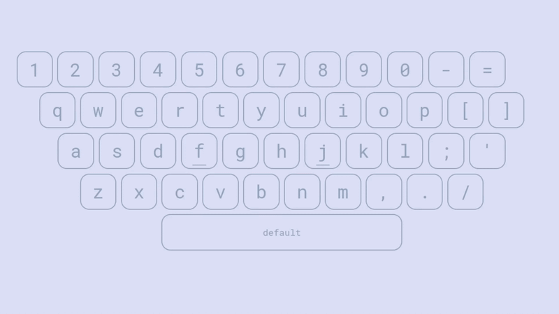
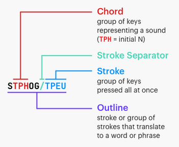

# Chapter 1: Introduction

> This series is work in progress!

So you want to learn stenography! It's a very long road ahead, but I do hope this series will help guide you along the way. Thanks to Plover and the efforts from the Open Steno Project, stenography is no longer restricted to professionals and students. The hobbyist steno community is flourishing, and self-taught professional stenographers are becoming more and more common.

## How does steno work?


Stenography (steno for short) is a method of text input that utilizes a chorded keyboard layout to write parts of words, entire words, or even phrases. Before delving into the details of how steno works, first think about regular keyboards—for example, how one would type the word "complicate":



Every letter is simply pressed individually:
```
c/o/m/p/l/i/c/a/t/e
```

> The slashes represent separators between key presses.

This results in 10 successive key strokes. On the other hand, steno uses *chords*, or groups of keys that are pressed down all at once. This action of pressing down multiple keys simultaneously is called a stroke. By using chords the word "complicate" can be written using only three strokes:

```
com/pli/cate
```

<steno-outline stroke="KOPL/PHREU/KAEUT" width="100%" alt="writing 'complicate' with steno"></steno-outline>

We could notate writing this word using steno like so:

```
KOPL/PHREU/KAEUT
```

### Why `KOPL/PHREU/KAEUT`?

At first glance, it appears that `KOPL/PHREU/KAEUT` has no bearing resemblance to the word it represents. The reason for this is that there are only so many keys on the steno layout. Arbitrary letter combinations have to be used in order to represent the sounds that are not represented by single keys.


In our example, `PL` in `KOPL` represents the ending "m" consonant; `HR` in `PHREU` represents the initial "l" consonant; `EU` in `PHREU` represents the "i" vowel, as in "p<ins>i</ins>t"; finally `AEU` in `KAEUT` represents the /eɪ/ diphthong (also called *long a* vowel) as in "f<ins>a</ins>te".

The following table illustrates the sounds that each key group represents in our example.

| | | | | | | | | | | | |
| -- | -- | -- | -- | -- | -- | -- | -- | -- | -- | -- | -- |
| **Steno Keys** | `K` | `O` | `PL` | | `P` | `HR` | `EU` | | `K` | `AEU` | `T` |
| **Sounds** | k | o | m | | p | l | i | | k | ā | t |

Essentially, `KOPL/PHREU/KAEUT` really just represents `KOM/PLI/KĀT` (where `Ā` represents the *long a* vowel or /eɪ/ diphthong).

And that's basically all there is in principle! Stenographers memorize a whole slew of chords for the missing sounds, and string multiple strokes together to write English.

Here's a demo of what it looks like to write at 224 WPM with steno:

<video controls>
<source src="img/1-demo.mp4" type="video/mp4">
</video>

### "Raw steno" terminology

Before we continue, it's important to be aware of some of the terminology surrounding key presses in steno.

* *Chord*: a group of keys that represent a sound.

* *Stroke*: synonymous with chord; can also be a verb describing the action of pressing a chord.

* *Outline*: a group of one or more strokes that is mapped to a translation.

Here is an excellent graphic from [Jen's steno explainers](https://steno.sammdot.ca/steno-terminology.png):



### Steno is primarily phonetic

Notice how so far sounds have been emphasized rather than spellings of words. In our example, "complicate" is not spelled with a "k" and yet it still uses the `K` key in the first stroke. The reason for this is that English spelling is quite complicated, but its phonetics are comparatively simple. Steno takes advantage of this by being a primarily phonetic system. In general, words are written based on their pronunciation. The `K` key represents all "k" sounds, regardless of spelling.

However, if steno were completely phonetic, it would be impossible to differentiate between "gait" and "gate", or "site", "cite", and "sight", or any of the other numerous homophones that English has. For some words, we do have to take spelling into consideration. How exactly this is done is dictated by the rules found in a steno theory.

### Steno theories

A *steno theory* refers to the set of rules that govern how words are broken down. While the basics (such as everything mentioned so far) are more or less the same between theories, there are some subtle differences. When it comes to learning English steno, it is not important which theory to start off with—it isn't difficult to switch between them.

The primary way steno theories differ is in their philosophy. For example, Phoenix theory is based off of a comprehensive set of rules that make it easy to break down complicated words. On the other side of the spectrum, Magnum theory places more emphasis on learning words themselves through rote memorization. In essence, there are fewer strict rules, but more arbitrary outlines to remember.

Most steno theories (like the previously mentioned ones) are not free and require you to purchase textbooks along with their dictionaries. The only free theories (as of this writing) are Lapwing theory, Plover theory, and Platinum theory.

Unfortunately, most steno theories are also quite specific to one accent. In particular, all of the mentioned theories are all based on a General North American accent. It may be difficult to learn one of these theories for those that speak a different variant of English; being able to comfortably subvocalize with an American accent is important.

There has been one effort in the Open Steno community to create a theory based for non-rhotic accents (i.e., British English), but I cannot recommend it as the dictionary is not very complete.

### How steno works from the software side

The keys pressed in an outline are translated to text that shows up on screen via a *steno engine*. This is a program on a computer, or is embedded in a keyboard's firmware. Steno engines use large files called *dictionaries* that simply contain 1-to-1 translations between steno outlines and their output. This makes steno entirely deterministic and predictable.

For example, here is one section from Lapwing theory dictionary:

```
"TKUR/KWRABLT": "durability",
"TKUR/KWRES": "duress",
"TKUR/KWRUPL": "durum",
"TKUR/PWHREU": "durably",
"TKUR/AEUGS": "duration",
"TKUR/-BL": "durable",
"TKUR/-BLT": "durability",
"TKURPB": "durn",
"TKURBL": "durable",
```

Many steno dictionaries have upwards of hundreds of thousands of *entries*. It's important to remember that the majority of these  are predictable as they follow the rules governed in a steno theory. Stenographers don't simply just memorize every single entry in their dictionary—that would be insane!

This, however, does bring up the concern of what to do when a word is not defined in a a stenographer's dictionary. In these cases, there is a technique for letter-by-letter input (called *fingerspelling*). This technique is rather slow (~40 WPM), but it is not a common occurrence. Furthermore, a good stenographer is expected to add any outlines they find missing according to their theory rules. There is no such thing as a word that is difficult to represent in steno strokes. A good theory will provide a set of rules that makes it very easy to break down a complicated word into simple steno strokes.

Another important feature of steno (due in part to its usage of dictionaries) are abbreviated entries, or *briefs*. These are outlines that do not 100% follow basic theory rules. They contain fewer strokes and, as a result, are faster to write. This helps for building speed and are often used for the most common words in English.

#### Non-word translations

Steno's usage of dictionaries also allows for non-word translations such as symbols, keyboard shortcuts, arrow keys, commands, and so on. It is a myth that steno can only be used to write English text; there are many systems that easily mesh with English steno theories that can allow you to write anything that a regular keyboard can. These systems do not use the phonetics of English steno theories, but rather shapes and chords that are simple and easy to remember. If you've memorized the locations of keys on a QWERTY keyboard (even just a few), you've easily got the mental flexibility to use steno for non-word translations.

Some hobbyists can even use [steno for coding](https://www.youtube.com/watch?v=T_kMd7rxYU0) and [steno with vim](https://www.youtube.com/watch?v=8-oDPhmpN9g)! Of course, that's not to say that everyone should use steno for these purposes, but it is certainly possible and some people prefer it over using a regular keyboard. This series will focus on writing English prose, but in later chapters I will discuss tools that allow you to use steno for editing text, controlling your computer, and even a little coding!

## Conclusion

I hope this has helped to demystify stenography! In the next chapter, I will be discussing steno hardware and software to get you started on learning steno!
