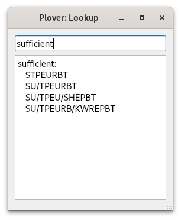
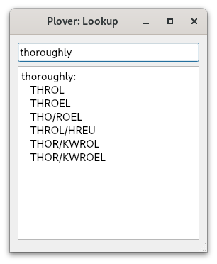
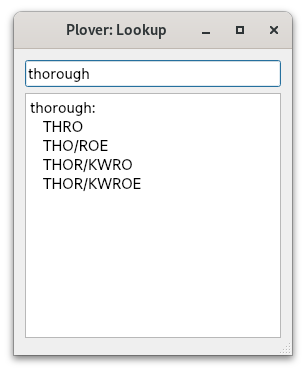
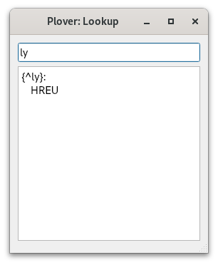

# Chapter 3: How to learn steno

## Steno is difficult

Before starting to learn steno, it is important to know that it is not something that can be easily picked up within a week. Personally, it took me about 3 months to achieve a consistent 30 WPM speed. While not nearly as difficult as learning a new language, the difficulty is definitely comparable to something like learning a musical instrument. Learning steno takes a lot of (good) practice and patience. You should not be expecting to double your typing speed in just a month.

In fact, it took me 6 months to reach 150 WPM on some TypeRacer quotes, but my speed varied quite a lot as novel and unfamiliar words would throw me off. While my top speed was indeed quite fast during this period, my average speed of 90 WPM wasn't significantly faster than a good QWERTY typist. Another 6 months later, I was at a consistent 180 WPM on most Monkeytype quotes. Another year and a half after that, I completely switched to steno for all computer tasks.

I hope reading this has not discouraged you from picking up steno, but I do have to be honest and straightforward about it. If you are not discouraged, however, I do believe you have the right mindset to succeed!

## Take steno as a challenge!

When I first started learning stenography, I knew that people were saying it is very difficult to learn. Instead of being discouraged by this, it motivated me even more. In the back of my mind, I wanted to prove that steno wasn't that difficult and that maybe I could learn it faster than most people. While this is quite egotistical, I do think this mindset helped me along the way; even though I did not learn steno as fast as I had hoped.

If you're not feeling this way, but still want to learn, try to convince yourself that you can do this! Compared to other skills or technical abilities, steno is something that I truly believe anyone can do. You don't have to necessarily have quick fingers, and you don't have to have an exceptional memory. In my opinion, all you need is a lot of free time, some patience, and a good steno board.

I should also mention that if, at any point in your steno journey, you are feeling discouraged at your progress, don't give up! Most people take 6 months to a year to reach their old typing speed. It is a gradual process, and one that you should be finding fun.

Believe in yourself! Face learning steno as a challenge!

## How do I learn?

### Lapwing chapters

This series is aimed at being a complete guide to learning steno. While you will learn everything that you need to know to be fast at steno, practice and fluency is key.

Each chapter in this series follows the same basic format: new theory and practice material introduced in subsections followed by a chapter test. The purpose of this test is to ensure that you have learned the material well enough. It is crucial that you are comfortable and well acquainted with each chapter before moving onto the next.

Everyone's threshold of being "comfortable" differs and it is up to you to decide what this means for you. For some, maybe this just means reading through the chapter with a little practice. For others, maybe this means practising the drills for a week. It is completely up to you to decide when to proceed to the next chapter. However, if you have no idea when you should move on, I recommend following the recommended passing requirement at the end of each chapter test.

#### Optional briefs

Lapwing is full of briefs and write-outs. A brief is an *abbreviated* outline that is used for speed. It may not follow theory at all and can be completely arbitrary. On the other hand, write-outs are outlines that are logical and follow theory rules. Until you start speed building, you should focus on write-out entries.

This book will emphasize learning the rules behind write-outs, but a lot of common words are written using briefs. Many of these briefs are covered gradually in each chapter. It's not important to explicitly memorize them, but I would suggest at least skimming through them at the end of your practice. After all, these briefs will be covered again in a later chapter; you are free to ignore the optional briefs at the end of each chapter if you wish to learn them all at once in chapter 16.

#### Daily practice

Try to aim for at least 15 minutes of practice a day. Ideally, one hour would be best. As mentioned, consistency is key to becoming fluent at steno. However, any more than three hours a day is approaching excessive. Steno is not simply something you can throw more time at to expect better results. By nature, it is something that has to be developed over a long period (like learning a musical instrument or a language). Remember to take breaks, and do not force yourself to practise more than you want to!

### Incorporating steno into your computer usage

It's always a good idea to apply your learning to complement exercises in a textbook. However, I would only recommend incorporating steno into your computer usage after reaching chapter 18. If not, you will have to make liberal use of the lookup tool. It is very important to know how to use this tool correctly. If you blindly follow the entries that show up, you may find yourself confused and frustrated as to why a word is written the way it is. You may also force yourself to inadvertently memorize more briefs.

Plover has a built-in tool to easily look up outlines. It can be found in <code class="code-mono">Tools → Lookup</code>. Make sure to read the tips below if you would like to use this tool.

#### Use the longest outline available

Due to the nature of briefs and write-outs, briefs tend to use fewer strokes and write-outs tend to use more. When you type in a word into the lookup tool, both types of entries will be present. I recommend using the longest outline in the lookup tool as that is overwhelmingly likely to be a write-out.

In the following example, the first two entries are briefs, while the last two are write-outs. You should be using one of these two. Defaulting to the longest outline available is very safe.

That being said, if one of the shorter outlines makes sense to you, then by all means use it!

#### Be careful of hidden affixes

The Lapwing dictionary may not contain every single valid outline. You will later learn of *affix strokes* which attach to root words. For example, the word "thoroughly" contains "thorough" as a root word and "^ly" as a *suffix*. One way to write "thoroughly" is `THOR/KWROE/HREU`. However, it does not show up in the dictionary:

Instead, remove the "^ly" suffix and look up the word "thorough". You will find `THOR/KWROE` as a valid outline:

To write the "^ly", you could look this up too:

The curly braces indicate that this word is special. In this case, the caret indicates that it will attach on that side. Putting these two outlines together, you would get `THOR/KWROE/HREU`. This is the canonical way you would write the word "thoroughly" even though it is not in the dictionary.

## Switching to steno completely from day 1

If you're familiar with learning alternative keyboard layouts such as Colemak and Dvorak, you may be tempted to try and use steno for everything right from day 1.

**I would not recommend this at all.**

In contrast to typing where you only need to know the location of the keys, there is much more complexity with steno. If you try to ditch regular typing too early on, you will constantly encounter concepts that won't make sense and will only fuel your frustration. Furthermore, to switch to steno full time, you need to be able to write things that are not just English words. This includes symbols, keyboard shortcuts, editing text, and more. Trying to learn all of this at once is unwise.

Instead, I would highly encourage you to follow the structure of this book; the concepts are spread out over 26 chapters which makes the learning curve much less steep. Treat learning steno as a hobby on the side. Your ultimate goal may be to replace your regular keyboard with steno, but you need to at least be familiar with basic theory before doing so. Rushing will not get you anywhere.