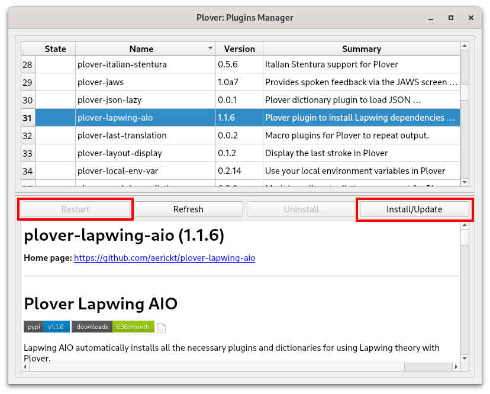
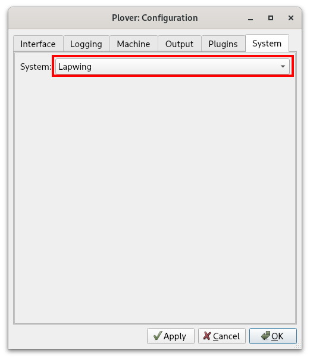
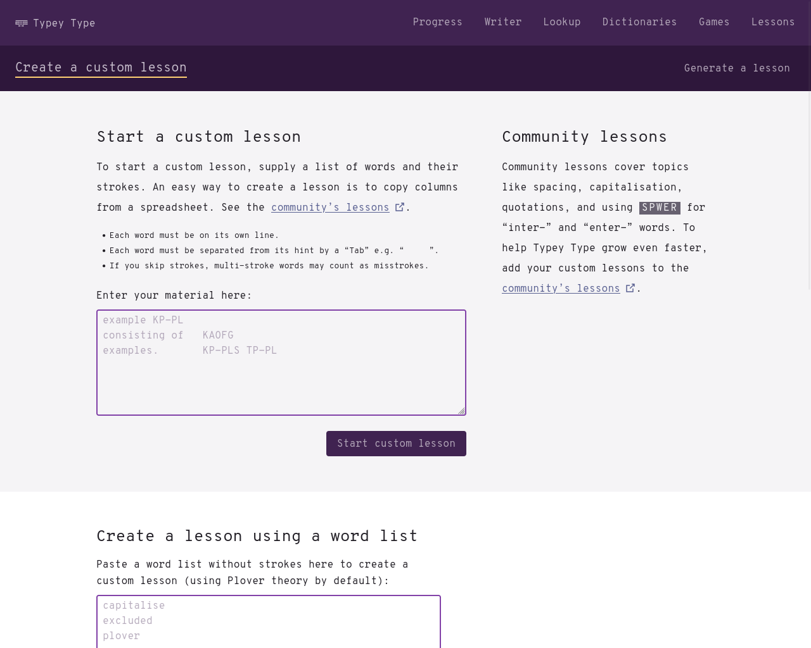
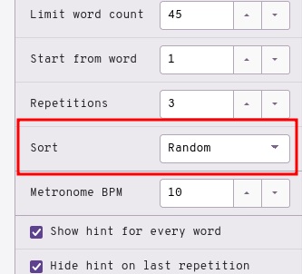
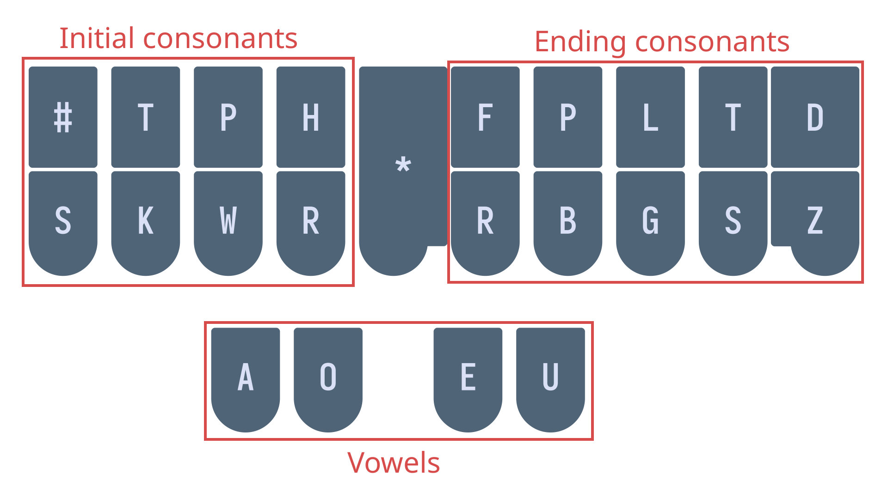
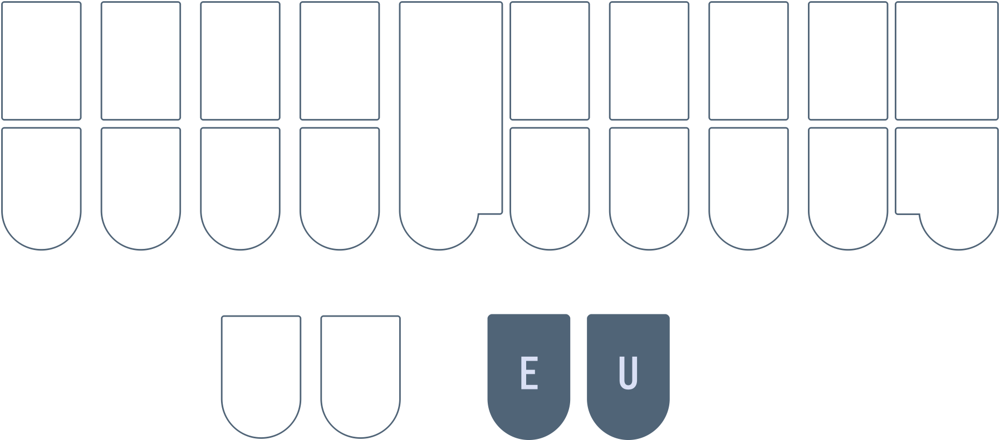
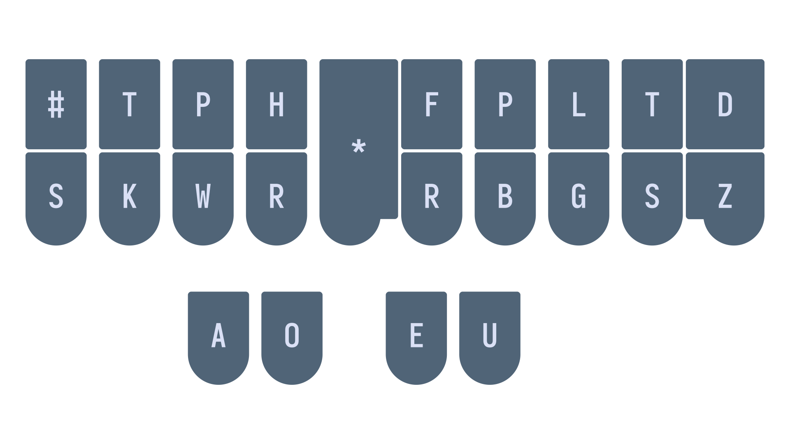
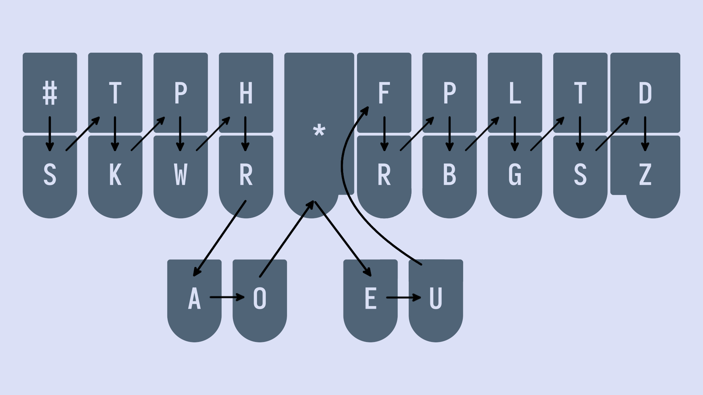
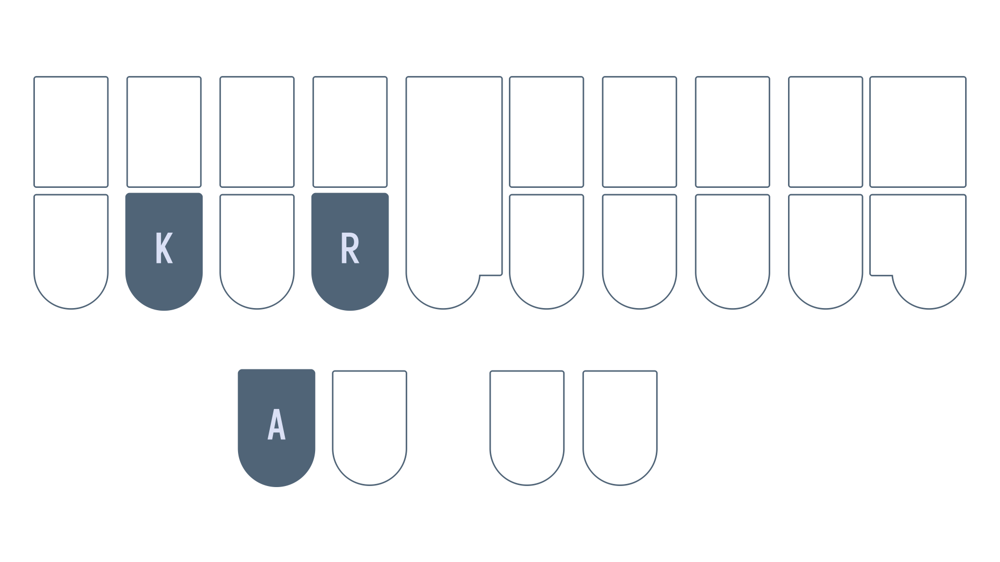
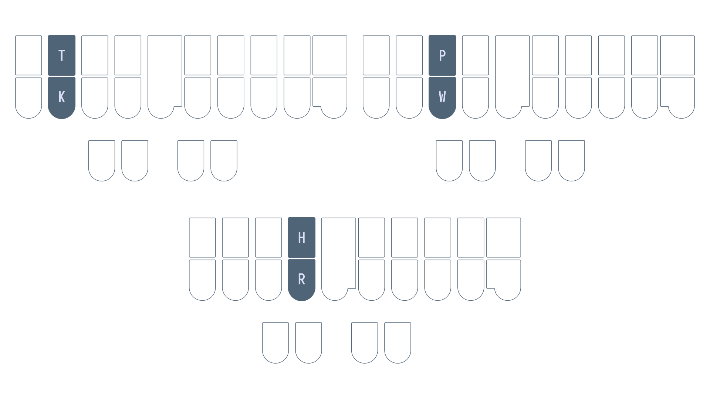

# Chapter 5: Lapwing setup and basics

## Recommended pace

**Recommended time to spend on this chapter: 2–5 days.**

1. Set up [Lapwing](#lapwing-setup) (**5 minutes**)
1. Familiarize yourself with [Typey Type](#typey-type) (**5 minutes**)
   * Play around with various settings if you'd like
1. Read [Single key basics](#single-key-basics) and complete the drill (**30 minutes**)
   * Repeat the drill as needed
1. Read [Consonant keys](#consonant-keys) (**2 minutes**)
1. Read [The missing short vowel](#the-missing-short-vowel) and complete the drill (**15 minutes**)
   * Repeat the drill as needed
1. Read [Left hand d, b, and l](#left-hand-d-b-and-l) and complete the drill (**20 minutes**)
1. Attempt the [test](#chapter-5-test) (**20 minutes**)
   * Practise as needed

Remember to take breaks!

## Useful links

* [Typey Type custom lessons](https://didoesdigital.com/typey-type/lessons/custom/setup)
* [Basic single syllable words drill](practice/5-cvc.txt)
* [Basic left hand single syllable words drill](practice/5-basic-left-hand.txt)
* [Single syllable dbl words drill](practice/5-dbl.txt)
* [Chapter 5 test](practice/5-test.txt)

## Lapwing setup

The Plover app comes loaded with a default theory called Plover theory. As this series is for learning Lapwing theory, there are a few modifications needed before proceeding. There are two options: install the <code class="code-mono">plover-lapwing-aio</code> plugin, or add the Lapwing dictionaries manually (not recommended). If in doubt, follow the instructions below for the all-in-one plugin as discussed below.

> If you are using Javelin, make sure to read [Appendix C](Appendix-C.md#chapter-5) for instructions on setting up your keyboard with Lapwing.

### Using the all-in-one plugin

In Plover's main window, click on <code class="code-mono">Tools → Plugins Manager</code>. Scroll down until you see <code class="code-mono">plover-lapwing-aio</code> and select it. Press <code class="code-mono">Install/Update</code> and make sure to press the <code class="code-mono">Restart</code> button afterwards.

> **NOTE:** just closing the main window is not sufficient to restart Plover. **You will have to press the restart button or manually quit Plover by going to <code class="code-mono">File → Quit Plover</code> and opening Plover again.**

Once Plover has been restarted, in Plover's main window, click on <code class="code-mono">Configure → System</code> and change the system to <code class="code-mono">Lapwing</code>. Press <code class="code-mono">Apply</code> and <code class="code-mono">OK</code>—you should now be good to go!

> If you'd like to know more about the default dictionaries that come with the all-in-one plugin, have a look at the [homepage](https://github.com/aerickt/plover-lapwing-aio).

### Setting up Lapwing manually

If you do not want to use the all-in-one plugin, please see [Appendix B](Appendix-B.md) if you wish to set up Lapwing dictionaries manually (not recommended).

## Typey Type

From this point on, exercises will be done on Typey Type. The benefit is that custom lessons with their own recommended outlines can be configured.

### [Click here to access Typey Type shown above](https://didoesdigital.com/typey-type/lessons/custom/setup)

Lessons in this series will be provided as links to text files. Left clicking on these links will display the contents of each lesson. Copy and paste the entire file (<code class="code-mono">Ctrl + A</code> or <code class="code-mono">Cmd + A</code>  to select the whole page) into the text box above. After that, press <code class="code-mono">Start custom lesson</code>.

**Make sure to sort the words randomly on the right hand side.**

You may tweak additional settings to your liking, but the defaults are perfectly fine. If you would like to try this out, here is one example of a lesson:

[Click here to access a sample lesson](practice/5-cvc.txt)

## Single key basics

Each steno stroke is made up of three main parts: the initial consonant, the vowel, and the ending consonant.

**If a single key makes up one of these parts, it will represent the sound that the letter is associated with.**

For example, the strokes `TAP` and `HUT` from the previous chapter's test represent the words "tap" and "hut" respectively. The stroke `KAT` represents the word "cat".

> **NOTE:** most consonants are phonetic, meaning that we care about the pronunciation rather than the spelling. This is why the initial consonant in "cat" is given the `K` key. You will later see that not all steno aspects are phonetic—some are orthographic (meaning that they are based upon spelling instead).

If one of these parts of the steno stroke is not a single key (i.e. it is a chord), it will not necessarily represent the combination of the individual letter sounds. Sometimes this does work; combining the left hand `S` and `H` keys can represent the initial "sh" sound as in "<ins>sh</ins>ut".

However, sometimes the individual keys in a chord have nothing to do with the actual sound it represents. For example, the right hand `-PB` chord represents the ending "n" sound as in "su<ins>n</ins>".

> These chords are covered later on, so do not worry too much about this for now. The main takeaway of this section is understanding what to do for simple words whose parts can be composed of single keys.

### Consonant keys

Some consonants may represent multiple sounds. This table will clear up any ambiguities.

| Steno key | Examples                         |
|-----------|----------------------------------|
| `S`         | <ins>s</ins>at <ins>s</ins>ill   |
| `T`         | <ins>t</ins>en </ins>t</ins>ap   |
| `K`         | <ins>k</ins>ing <ins>c</ins>ar   |
| `P`         | <ins>p</ins>at <ins>p</ins>ull   |
| `W`         | <ins>w</ins>in <ins>w</ins>att   |
| `H`         | <ins>h</ins>ot <ins>h</ins>um    |
| `R`         | <ins>r</ins>ed <ins>r</ins>an    |
| `-F`        | pu<ins>ff</ins> cou<ins>gh</ins> |
| `-P`        | hi<ins>p</ins> sa<ins>p</ins>    |
| `-B`        | lo<ins>b</ins> hu<ins>b</ins>    |
| `-L`        | fa<ins>ll</ins> lo<ins>l</ins>   |
| `-G`        | sa<ins>g</ins> tu<ins>g</ins>    |
| `-T`        | righ<ins>t</ins> pi<ins>t</ins>  |
| `-S`*       | pa<ins>ss</ins> ha<ins>s</ins>   |
| `-D`        | ta<ins>d</ins> ri<ins>d</ins>    |
| `-Z`        | ja<ins>zz</ins> fi<ins>zz</ins>  |

\*`-S` is used whenever the ending sound is spelled with the letter "s". This is why "has" and "pass" both use `-S`, despite having a different sound.

### Short vowel sounds

Vowel keys are more tricky than consonants because they are not entirely phonetic or orthographic. We will first look at what *short vowels* are in Lapwing.

The term *short vowel* is an informal term that is often taught in North American classrooms. It is not very linguistically sound, so the next few sections will attempt to define them more rigorously.

> Throughout the vowel sections, the IPA (International Phonetic Alphabet) for each sound is listed. This is only intended for those who are already familiar with it. Do not worry at all if you are not familiar with IPA!

#### *Short a*

IPA: /æ/

* <ins>c</ins>at
* h<ins>a</ins>t

<video controls>
<source src="img/5-pronunciations-short-a.mp4" type="video/mp4">
</video>

#### *Short e*

IPA: /ɛ/

* p<ins>e</ins>t
* s<ins>e</ins>ll

<video controls>
<source src="img/5-pronunciations-short-e.mp4" type="video/mp4">
</video>

#### *Short i*

IPA: /ɪ/

* w<ins>i</ins>ll
* s<ins>i</ins>t

<video controls>
<source src="img/5-pronunciations-short-i.mp4" type="video/mp4">
</video>

#### *Short o*

IPA: /ɑ/

* c<ins>o</ins>t
* r<ins>o</ins>d

> In my accent, /ɑ/, /ɔ/, and /ɒ/ all are merged. If they are distinct in your accent, they can all be considered as *short o*.

<video controls>
<source src="img/5-pronunciations-short-o.mp4" type="video/mp4">
</video>

#### *Short u*

There are two sounds associated with this term.

IPA: /ʌ/

* c<ins>u</ins>p
* h<ins>u</ins>t

IPA: /ʊ/

* c<ins>ou</ins>ld
* p<ins>u</ins>ll

<video controls>
<source src="img/5-pronunciations-short-u.mp4" type="video/mp4">
</video>

### The schwa

Schwa is an English sound that all vowel letters can sometimes represent. For example, the underlined letters in the following words are all pronounced as schwas—they are not enunciated like any of the vowel sounds above.

* <ins>a</ins>bout
* p<ins>e</ins>tition
* def<ins>i</ins>nite
* p<ins>o</ins>tato
* s<ins>u</ins>pport

### Simple vowels rule #1:

**Short vowel sounds and schwa spelled with a single letter use the key/chord that matches the spelling.**

#### Examples

* hat `HAT`
* pet `PET`
* cot `KOT`
* hut `HUT`

> **NOTE:** *short vowels* are almost always spelled with the sound they represent. However, one exception is the word "son", which has a *short u* vowel. Remember that we care about spelling for *short vowels*, this word would be written using the `O` key.

### The i chord

There is no "i" key on the steno layout; it is instead represented by the `EU` chord.

#### Examples

* hit `HEUT`
* pill `PEUL`
* pit `PEUT`
* tip `TEUP`

### Simple values rule #2:

**Short vowel sounds spelled with multiple letters use the key/chord that matches the sound.**

> Schwa sounds that are spelled with multiple letters are fairly uncommon. If you encounter any, you are meant to use any of the vowel letters that spell part of the sound. If you run into a missing entry, just add it to your personal dictionary.

#### Examples
* could `KUD`
* head `HED`
* said `SED`
* tough `TUF`

### Vowels with r

In a General North American accent, inclusion of the letter "r" after a vowel can alter the pronunciation of the vowel. Take, for example, the following pairs of words:

| Normal | r | IPA |
| - | - | - |
| cat | car | /ɑɹ/ |
| head | her | /ɝ/ or /ɚ/ |
| sit | sir | /ɝ/ or /ɚ/ |
| pot | pore | /ɔɹ/  |
| pull | purr | /ɝ/ or /ɚ/ |

These sounds are also considered to be in the same group as *short vowels*, so rule 1 applies. We will still write these words with the key that spells the vowel, even if it is phonetically a different sound.

> **NOTE:** keep in mind that you still have to identify *short vowels* before using rule 1. For example, the vowel in "cure" is **not** a *short vowel* and **cannot** be written like `KUR`.

#### Examples

* car `KAR`
* her `HER`
* sir `SEUR`
* pore `POR`
* purr `PUR`

### Section practice material

[Basic single syllable words drill](practice/5-cvc.txt)

## Steno order

Looking at the steno layout, why is it that "car" must be written using the left `K`, and the right hand `-R`?

The answer is *steno order*.

Sounds you make on the layout are supposed to follow this order.

**\#STKPWHRAO\*EUFRPBLGTSDZ**

Therefore, the only correct way to write the word "car" would be  `KAR`.

**\#ST<ins>K</ins>PWHR<ins>A</ins>O\*EUF<ins>R</ins>PBLGTSDZ**

The following is an incorrect way to write "car"; it is actually notated like `KRA`:

It's not necessary to memorize steno order explicitly (as in the `#STKPWHRAO*EUFRPBLGTSDZ` string). However, it's important to internalize steno order with regard to the location of the keys. With enough practice, it should be immediately obvious that the "-st" sound as in "past", for example, cannot be represented in steno order.

### Impossible single syllable words

Below are two single syllable words that cannot be written in one stroke because of steno order.

* trust 
  - Closest would be `TRUTS`
  - \#S<ins>T</ins>KPWH<ins>R</ins>AO*E<ins>U</ins>PBLG<ins>TS</ins>DZ
* turf 
  - Closest would be `TUFR`
  - \#S<ins>T</ins>KPWHRAO*E<ins>UFR</ins>PBLGTSDZ

To represent a sound in a steno stroke, the sounds should be available on the layout and should fall in the correct order. Although the sounds are indeed available on the layout, they fail the second requirement. For now, do not worry about writing these words—they involve more advanced chords and concepts that will be introduced later.

## Combining single left hand keys

On the initial consonants side, there are several chords whose sounds are simply just the combination of the individual keys. Some of these are:

* `ST` as in "<ins>st</ins>op"
* `SK` as in "<ins>sc</ins>ar"
* `SP` as in "<ins>sp</ins>ot"
* `SH` as in "<ins>sh</ins>op"
* `TH` as in "<ins>th</ins>ug"
* `TR` as in "<ins>tr</ins>ap"
* `KH` as in "<ins>ch</ins>ug"
* `KR` as in "<ins>cr</ins>op"
* `PR` as in "<ins>pr</ins>at"

> `KH` for "ch" might not be immediately obvious, but just remember that `K` is used for the "hard c" sound. Thus, if you accept that `K` can represent the letter "c", then combining it with the `H` key makes some sense.

This does not just apply to chords with two keys. For example, `THR` can represent the "thr" sound as in "thread". Chances are, if a chord makes sense based on the individual keys it is made of, it is valid.

### Section practice

[Basic left hand single syllable words](practice/5-basic-left-hand.txt)

## Left hand d, b, and l

* `TK` is "d" as in "<ins>d</ins>ab"
* `PW` is "b" as in "<ins>b</ins>ot"
* `HR` is "l" as in "<ins>l</ins>et"

### Examples

* dad `TKAD`
* bar `PWAR`
* lap `HRAP`
* bled `PWHRED`

### Mnemonics

> Feel free to come up with your own or even suggest some!

1. Each of these chords are simply two keys in a column
   * `TK` is pressed by the left hand ring finger
   * `PW` is pressed by the left hand middle finger
   * `HR` is pressed by the left hand index finger
2. Think "DBL"
   * <ins>d</ins>ou<ins>bl</ins>e (these are *double* keys) 
     * From [Art of Chording](https://www.artofchording.com)
   * <ins>d</ins>eci<ins>b</ins>e<ins>l</ins>
   * <ins>d</ins>ata<ins>b</ins>ase <ins>l</ins>over

### Section practice

[Single syllable dbl words](practice/5-dbl.txt)

## Chapter 5 test

This chapter's test consists of all the practice drills you have done so far in this chapter. Make sure your settings are configured as such:

* Limit word count: 45
* Start from word: 1
* Repetitions: 3
* Sort: random
* Show hint for every word: unchecked
* Hide hint on last repetition: unchecked
* Show hint on misstroke: checked

[Click here to access the chapter 5 test](practice/5-test.txt)

### Recommended completion goal

This is only a suggestion; it is not a requirement to move to the next chapter!

**Aim for 10–20 WPM with 90% accuracy.**

**You may use the test material as practice!**

## Chapter briefs

> This section is completely optional, but recommended. If you prefer to learn these all at once, they will be covered in chapter 16.

| Word | Brief   | Explanation                                 |
|------|---------|---------------------------------------------|
| are  | `R` or `-R` | Sounds like the letter "R"                  |
| did  | `TK`      | <ins>d</ins>id                              |
| do   | `TKO`     | Matches the spelling                        |
| I    | `EU`      | Matches the spelling                        |
| is   | `S`       | Common word for a single key brief          |
| so   | `SO`      | Matches the spelling                        |
| the  | `-T`      | Common word for a single key brief          |
| you  | `U`       | Sounds like the letter "U"                  |
| .    | `TP-PL`   | Symmetrical shape for the period/full stop. |
| ?    | `KW-PL`   | Shape resembles a rising intonation.        |

> **NOTE:** remember that these are briefs; the explanations are not applicable to any arbitrary word.

### Practice sentences

1. I do tip the lad.
2. you are so rad.
3. is the dip bad?
4. did you pat the cat?

#### Answers

1. `EU/TKO/TEUP/-T/HRAD/TP-PL`
2. `U/-R/SO/RAD/TP-PL`
3. `S/-T/TKEUP/PWAD/KW-PL`
4. `TK/U/PAT/-T/KAT/KW-PL`

### Extra briefs

| Brief   | Outline | Explanation |
|---------|---------|-------------|
| did you | `TKU`     | `TK` + `U`      |
| do you  | `TKOU`    | `TKO` + `U`     |
| is the  | `S-T`     | `S` + `-T`      |
| so the  | `SOT`     | `SO` + `-T`     |
| are the | `R-T`     | `R` + `-T`      |
| are you | `RU`      | `R` + `U`       |
