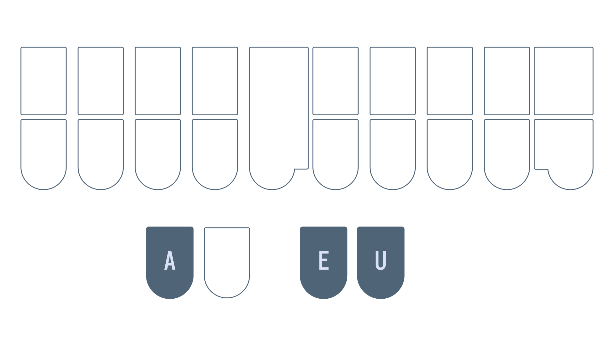
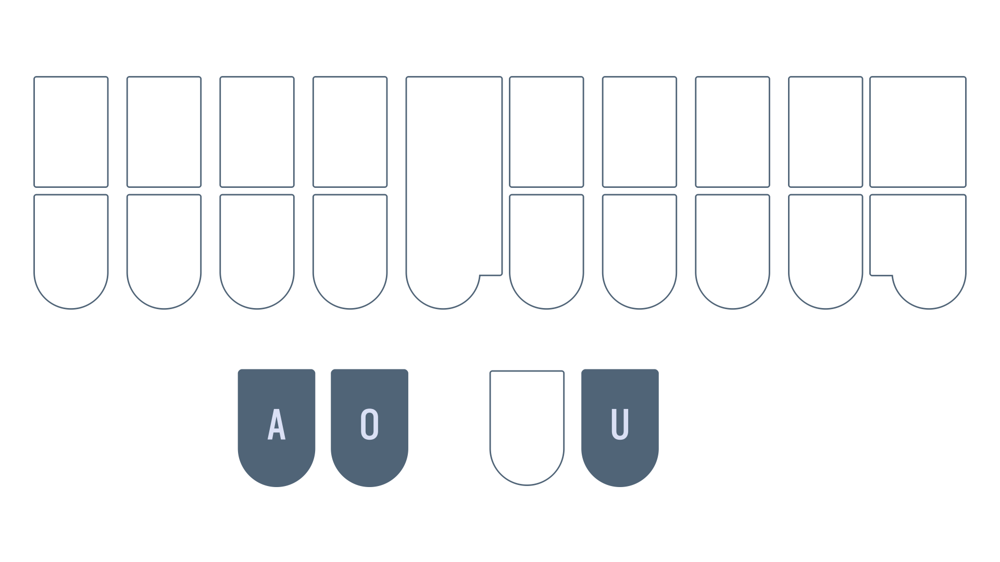

# Chapter 7: Vowels

## Recommended pace

**Recommended time to spend on this chapter: 2–3 days.**

1. Read [`OE`, `OU`, and `OEU`](#oe-ou-and-oeu) and complete the drill (**25 minutes**)
   - Repeat the drill as needed
2. Read [`AEU`](#aeu) and complete the drill (**15 minutes**)
   - Repeat the drill as needed
3. Read [`AOU`](#aou) and complete the drill (**15 minutes**)
   - Repeat the drill as needed
4. Attempt the [test](#chapter-7-test) (**20 minutes**)
   * Practise as needed

Remember to take breaks!

## Useful links

* [Single syllable `OE`, `OU`, and `OEU` words drill](practice/7-single-syllable-oe-ou-and-oeu.txt)
* [Single syllable `AEU` words drill](practice/7-single-syllable-aeu.txt)
* [Single syllable `AOU` words drill](practice/7-single-syllable-aou.txt)
* [Chapter 7 test](practice/7-test.txt)

## Intro

Vowels are reportedly the most difficult part of learning steno. Part of this is due to the fact that vowels are pronounced differently in different dialects of English. Unfortunately, I grew up learning General American English. This is the accent that Lapwing is based on. If you speak a different accent, you may have to subvocalize with an American accent.

I'm making an effort to include IPA with the hopes that they will be useful for some. However, I must make the disclaimer that I have never taken a formal linguistics course nor am I an enthusiast. I apologize for any errors that may be present in this page—do reach out to me if you have corrections!

## `OE`, `OU`, and `OEU`

* `OE` is the "long o" vowel as in "t<ins>o</ins>te"
   - /oʊ/

> Linguistically, calling this a "long vowel" is incorrect (this is actually a diphthong), but it's what most people would be familiar with ([see here](https://en.m.wikipedia.org/wiki/Vowel_length#%22Long%22_and_%22short%22_vowel_letters_in_spelling_and_the_classroom_teaching_of_reading)).

* `OU` is the "ow" sound as in "c<ins>ow</ins>"
   - /aʊ/
* `OUR` is the sound as in "h<ins>our</ins>"
   - /aʊ ər/

* `OEU` is the sound as in "t<ins>oy</ins>"
  - /ɔɪ/

<video controls>
<source src="img/7-pronunciations-1.mp4" type="video/mp4">
</video>

### Examples

* foe `TPOE`
* sow `SOE`
* now `TPHOU`
* power `POUR`
* coil `KOEUL`
* soy `SOEU`

<video controls>
<source src="img/7-pronunciations-2.mp4" type="video/mp4">
</video>

### Mnemonics

> Feel free to come up with your own or even suggest some!

1. The word "foe" uses `OE` which you can tell from its spelling
    - Apply this to other words with the same vowel sound!
2. The word "our" uses `OU` which, again, you can tell from its spelling
3. You can think of `OEU` as `O` + `EU` or "oi" which resembles its pronunciation and spelling (as in the word "s**oi**l")

### Section practice

[Single syllable `OE`, `OU`, and `OEU` words drill](practice/7-single-syllable-oe-ou-and-oeu.txt)

## `AEU`

* `AEU` is the "long a" vowel as in "p<ins>ay</ins>"
   - /eɪ/

> **NOTE:** be careful with words like "bag", "tank", and "sag"; these use `A` for /æ/ and **not** `AEU`. The difference is subtle, but try to convince yourself that these are different vowels.

* `AEUR` is the sound as in "p<ins>air</ins>"
   - /ɛr/

<video controls>
<source src="img/7-pronunciations-3.mp4" type="video/mp4">
</video>

### Examples

* day `TKAEU`
* lay `HRAEU`
* care `KAEUR`
* pair `PAEUR`

<video controls>
<source src="img/7-pronunciations-4.mp4" type="video/mp4">
</video>

### Mnemonics

> Feel free to come up with your own or even suggest some!

1. You can think of `AEU` as `A` + `EU` or "ai" which resembles its pronunciation and spelling (as in the word "p<ins>ai</ins>d")
2. If the notion of "long" and "short" vowels (as described above) is familiar, you can think of transforming the `A` key into a "long a" by combining it with the two keys on the other side
    - "Long a" = `A`  + (vowel keys on other hand)

### Section practice

[Single syllable `AEU` words drill](practice/7-single-syllable-aeu.txt)

## `AOU`

* `AOU` represents two different sounds:
   1. The "long u" sound as in "c<ins>u</ins>be"
      - /ju/
   2. The "long oo" sound as in "gl<ins>u</ins>e"
      - /u/
      - **Only when the sound is not spelled with "oo"**
        - E.g., "loo" would **not** use `AOU`

* `AOUR` is the sound as in "c**ur**e"
  - /ʊər/

<video controls>
<source src="img/7-pronunciations-5.mp4" type="video/mp4">
</video>

### Examples

* ew `AOU`
* sue `SAOU`
* lure `HRAOUR`
* pure `PAOUR`

<video controls>
<source src="img/7-pronunciations-6.mp4" type="video/mp4">
</video>

### Mnemonics

> Feel free to come up with your own or even suggest some!

1. If the notion of "long" and "short" vowels (as described above) is familiar, you can think of transforming the `U` key into a "long u" by combining it with the two keys on the other side
    - "Long u" = `U` + (vowel keys on other hand)
2. The "long u" sound is also quite similar to the "long oo" sound

### Section practice

[Single syllable `AOU` words drill](practice/7-single-syllable-aou.txt)

## Chapter 7 test

This chapter's test consists of all the practice drills you have done in this chapter. Make sure your settings are configured as such:

* Limit word count: 45
* Start from word: 1
* Repetitions: 3
* Sort: random
* Show hint for every word: unchecked
* Hide hint on last repetition: unchecked
* Show hint on misstroke: checked

[Click here to access the chapter 7 test](practice/7-test.txt)

### Recommended completion goal

This is only a suggestion; it is not a requirement to move to the next chapter!

**Aim for 10–20 WPM with 90% accuracy.**

**You may use the test material as practice!**
