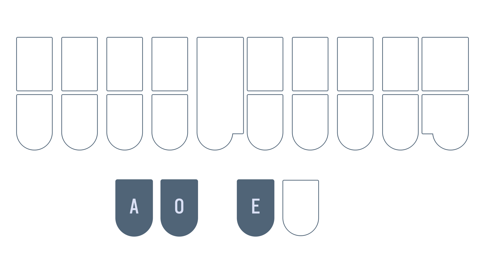
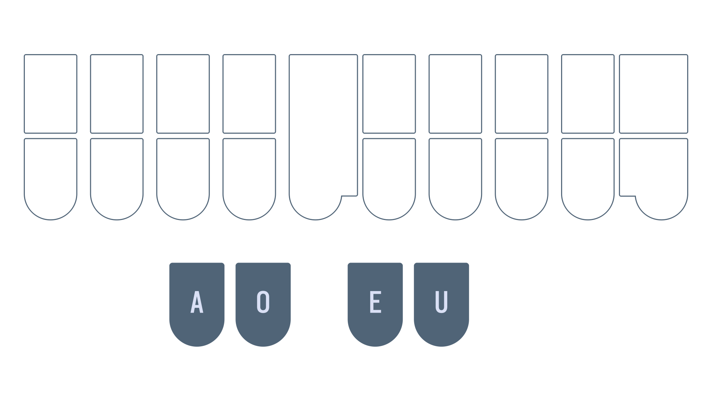
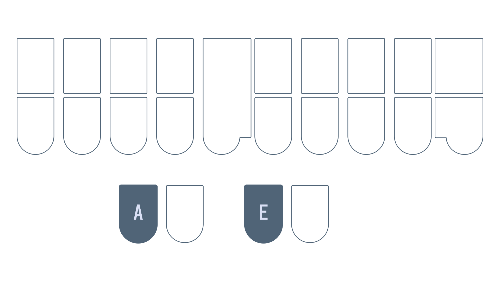
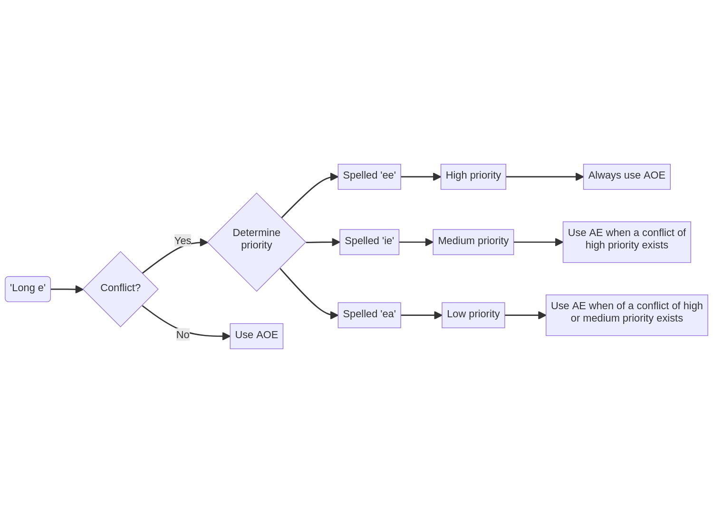
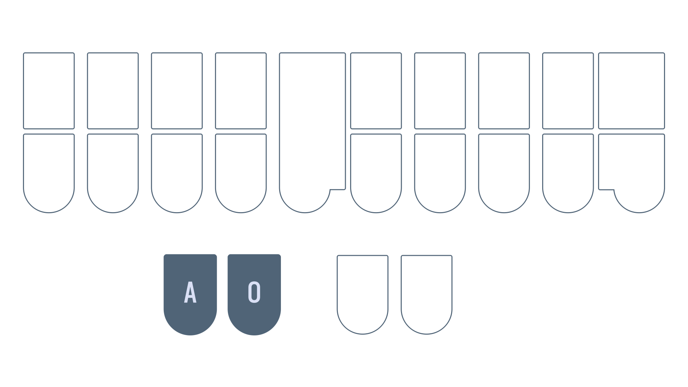

# Chapter 8: Vowels continued

## Recommended pace

**Recommended time to spend on this chapter: 2–3 days.**

1. Read [`AOE`](#aoe)and complete the drill (**15 minutes**)
   - Repeat the drill as needed
1. Read [`AOEU`](#aoeu) and complete the drill (**15 minutes**)
   - Repeat the drill as needed
2. Read [`AU`](#au) and complete the drill (**15 minutes**)
   - Repeat the drill as needed
2. Read [`AE`](#ae) and complete the drill (**15 minutes**)
   - Repeat the drill as needed
2. Read [`AO`](#ao) and complete the drill (**15 minutes**)
   - Repeat the drill as needed
3. Attempt the [test](#chapter-8-test) (**20 minutes**)
   * Practise as needed

Remember to take breaks!

## Useful links

* [Single syllable `AOE` words drill](practice/8-AOE.txt)
* [Single syllable `AOEU` words drill](practice/8-AOEU.txt)
* [Single syllable `AU` words drill](practice/8-AU.txt)
* [Single syllable `AE` words drill](practice/8-AE.txt)
* [Single syllable `AO` words drill](practice/8-AO.txt)
* [Chapter 8 test](practice/8-test.txt)

## Intro

Vowels are reportedly the most difficult part of learning steno. Part of this is due to the fact that vowels are pronounced differently in different dialects of English. Unfortunately, I grew up learning General American English. This is the accent that Lapwing is based on.

> If you speak a different accent, you may have to subvocalize with an American accent (sorry).

I'm making an effort to include IPA with the hopes that they will be useful for some. However, I must make the disclaimer that I have never taken a formal linguistics course nor am I an enthusiast. I apologize for any errors that may be present in this page—do reach out to me if you have corrections!

### What is a conflict?

Since steno is a primarily phonetic system, homophones can be tricky to deal with. For example, the words "pair" and "pear" are pronounced exactly the same, but it is not possible to assign them both to `PAEUR`. We would call this an example of a *conflict*; two words conflict with the same outline. In Lapwing theory, spelling is the primary way to resolve conflicts. This particular example of "pair" and "pear" is covered later in this chapter.

## `AOE`

* `AOE` is the *long e* sound as in "b<ins>ee</ins>t"
  - /i/
* `AOER` is the sound as in "p<ins>eer</ins>"
  - /ɪər/

<video controls>
<source src="img/8-pronunciations-1.mp4" type="video/mp4">
</video>

### Examples

* peel `PAOEL`
* teal `TAOEL`
* here `HAOER`
* seer `SAOER`

<video controls>
<source src="img/8-pronunciations-2.mp4" type="video/mp4">
</video>

### Mnemonics

> Feel free to come up with your own or even suggest some!

1. If the notion of *long vowels* and *short vowels* (as described in the previous chapter) is familiar, you can think of transforming the `E` key into a *long e* by combining it with the two keys on the other side
    - *Long e* = `E` + (vowel keys on other hand)

### Section practice

[Single syllable `AOE` words drill](practice/8-AOE.txt)

## `AOEU`

* `AOEU` is the *long i* sound as in "<ins>i</ins>ce"
  - /aɪ/
* `AOEUR` is the sound as in "<ins>ir</ins>e"
  - /aɪər/

<video controls>
<source src="img/8-pronunciations-3.mp4" type="video/mp4">
</video>

### Examples

* light `HRAOEUT`
* tile `TAOEUL`
* liar `HRAOEUR`
* tire `TAOEUR`

<video controls>
<source src="img/8-pronunciations-4.mp4" type="video/mp4">
</video>

### Mnemonics

> Feel free to come up with your own or even suggest some!

1. If the notion of *long vowel* and *short vowels* (as described in the previous chapter) is familiar, you can think of transforming the "i" chord into a *long i* by combining it with the two keys on the other side
    - *Long i* = `EU` + (vowel keys on other hand)

### Section practice

[Single syllable `AOEU` words drill](practice/8-AOEU.txt)

## `AU`

In chapter 5, the short vowel rules suggest that words like "bought" and "caught" would use the `O` key.

> **Short vowel rule #1: short vowel sounds and schwa spelled with a single letter use the key/chord that matches the spelling.**

> **Short vowel rule #2: Short vowel sounds spelled with multiple letters use the key/chord that matches the sound.**

However, "bought" and "caught" are homophones with "bot" and "cot" (at least with the accent Lapwing assumes). Therefore, we instead give an exception to the *short o* sound with regard to the two rules above.

**The *short o* sound is only written with `O` if it is spelled with a single "o". Any other spellings of the *short o* sound are written with `AU`.**

So while "bot" and "cot" are written as `PWOT` and `KOT`, respectively, "bought" and "caught" are written like so:

* bought `PWAUT`
* caught `KAUT`

<video controls>
<source src="img/8-pronunciations-5.mp4" type="video/mp4">
</video>

### Minor conflicts

Words spelled with "au" are given `A*UL` when there is a conflict:

* call `KAUL`
* caul `KA*UL`
* hall `HAUL`
* haul `HA*UL`

Words spelled with "awl" are also given `A*UL` when there is a conflict:

* all `AUL`
* awl `A*UL`
* ball `PWAUL`
* bawl `PWA*UL`

> There aren't very many of these conflicts to warrant a practice drill, but it is important to keep this in mind when you encounter unexpected output in everyday writing. This is also one area where it is completely safe to change the logic and remap words in your own personal dictionary.

### Section practice

[Single syllable `AU` words drill](practice/8-AU.txt)

## `AE` for `AEU`

Take a look at the following words:

* pair
* pear

The `PAEUR` outline cannot be assigned to both of these words. This is where `AE` comes into play. It is a secondary chord that can represent the same vowel as `AEU` when there is conflict.

In these conflicts involving the *long a* sound, one word will use `AEU`. This is the word with higher priority. The other word will use `AE`; this is the word with lower priority. Spelling is used to determine the priority to assign to a word.

### Highest priority: "ai" or "ei" spellings

Words spelled with "ai" or "ei" get the highest priority, and are always written using `AEU`:

* `AEUT` eight
* `TPAEUR` fair
* `PHAEUPB` main
* `PAEUR` pair

### Medium priority: "a_e" spellings

These words receive medium priority. Use `AE` for these words if there is a conflict with a word in the above category.

* `AET` ate (`AEUT` is already "eight")
* `TPAER` fare (`TPAEUR` is already "fair")
* `TAEUR` tare ("tair" is not a word)
* `PHAEPB` mane (`PHAEUPB` is already "main")

### Lowest priority: "ea" spellings

These words get lowest priority. If there is a conflict with any of the two categories above, use `AE`.

* `TAER` tear (`TAEUR` is already "tare")
* `PAER` pear (`PAEUR` is already "pair")
* `SWAEUR` swear ("swair" and "sware" are not words)

> **NOTE:** remember that `AE` is **only used to resolve conflicts**. Try not to associate this chord with any specific spelling or sound.

### Flowchart Summary

Here's a flowchart to summarize the above:

## `AE` for `AOE`

In addition to the `AEU` vowel, `AE` can also represent the `AOE` vowel when there are conflicts. Again, certain spellings are assigned to higher priority, while lower priority spellings use `AE`.

### Highest priority: "ee" spellings

All words spelled with "ee" use `AOE`

* `TPAOET` feet
* `PAOE` pee
* `SAOED` seed
* `TAOE` tee

### Medium priority: "ie" spellings

* `PAOES` piece

### Lowest priority: "ea" spellings

* `TPAET` feat (`TPAOET` is already "feet")
* `PAE` pea (`PAOE` is already "pee")
* `PAES` peace (`PAOES` is already "piece")
* `TAE` tea (`TAOE` is already "tee")

### Flowchart Summary

Here's a flowchart to summarize the above:

## Other uses of `AE` for disambiguating

`AE` can also be used for "ea" spellings that conflict with short vowels.

* lead `HRAED` (`HRED` is already "led")
* bread `PWRAED` (`PWRED` is already "bred")

## `AE` 3-way conflicts

You may wonder about, or even encounter a few 3-way conflicts. For example, "pair", "pare", and "pear". There really aren't that many of these so Lapwing doesn't actually provide any rules on how to deal with these.

By default the Lapwing dictionary assigns `PAER` to "pear" and `PA*EUR` to "pare". The reason for this is that "pear" is much more common and is considered higher priority than "pare". You are, of course, free to disagree with this logic and change things around! It is really up to you how you want to deal with these conflicts.

> **NOTE:** considering priority based on how common words are is generally used as a last resort where the rules are fuzzy or nonexistent (like in this example). You will not see this in any concrete Lapwing rules.

### Section practice

[Single syllable `AE` words drill](practice/8-AE.txt)

## `AO`

This chord has two uses:

1. Words spelled with "oo", regardless of their pronunciation
   - wood `WAOD`
   - hood `HAOD`
   - blood `PWHRAOD`
   - tool `TAOL`
2. Words spelled with "oa" to resolve conflicts
   - oar `AOR` (`OR` is already "or")
   - soar `SAOR` (`SOR` is already "sore")
   - boar `PWAOR` (`PWOR` is already "bore")
   - road `RAOD` (`ROED` is already "rode")

> **NOTE:** you may be tempted to write "boat" as `PWAOT`, but this is incorrect. The word "boat" should be written as `PWOET`, first and foremost (since there are no homophones with "boat"). Therefore, `PWAOT` is actually the word "boot".

### Section practice

[Single syllable `AO` words drill](practice/8-AO.txt)

## Chapter 8 test

This chapter's test consists of all the vowel drills (including chapter 7 material). Make sure your settings are configured as such:

* Limit word count: 45
* Start from word: 1
* Repetitions: 3
* Sort: random
* Show hint for every word: unchecked
* Hide hint on last repetition: unchecked
* Show hint on misstroke: checked

[Click here to access the chapter 8 test](practice/8-test.txt)

### Recommended completion goal

This is only a suggestion; it is not a requirement to move to the next chapter!

**Aim for 10–20 WPM with 90% accuracy.**

**You may use the test material as practice!**

## Chapter briefs

> This section is completely optional, but recommended. If you prefer to learn these all at once, they will be covered in chapter 16.

| Word | Brief | Explanation |
| ---- | ---- | ---- |
| had | `H` | Single key brief for a common word |
| people | `P` | Single key brief for a common word |
| this | `TH` | <ins>th</ins>is |
| there | `THR` | <ins>th</ins>e<ins>r</ins>e |
| when | `WH` | <ins>wh</ins>en |
| why | `KWR` | `KWR` is (sometimes) used for the "Y" letter |
| will | `HR` | wi<ins>ll</ins> |
| with | `W` | Single key brief for a common word |
| <code class="code-mono">Enter</code> or <code class="code-mono">Return</code> | `R-R` | <ins>r</ins>etu<ins>r</ins>n (equivalent to pressing <code class="code-mono">Enter</code> or <code class="code-mono">Return</code> on a keyboard). |
| <code class="code-mono">Capitalize the next word and suppress a space</code> | `KPA*` | This useful for starting new sentences in text fields where you don't want a leading space. |

> **NOTE:** remember that these are briefs; the explanations are not applicable to any arbitrary word.

### Practice sentences
1. When are the people here?
1. This is why we fight.
1. There are no moose!
1. Will you sleep now?
1. I have had it with you!

#### Answers
1. `KPA*/WH/R/-T/P/HAOER/KW-PL`
1. `KPA*/TH/S/KWR/WAOE/TPAOEUT/TP-PL`
1. `KPA*/THR/-R/TPHO/PHAOS/TP-BG`
1. `KPA*/HR/U/SHRAOEP/TPHOU/KW-PL`
1. `KPA*/EU/SR/H/T/W/U/TP-BG`

### Extra briefs

| Brief | Outline | Explanation |
| ---- | ---- | ---- |
| had the | `H-T` | `H` + `-T` |
| this is | `TH-S` | `TH` + `-S` |
| there is | `THR-S` | `THR` + `-S` |
| there's | `THR*S` | `THR` + `-S` + `*` |
| there are | `THR-R` | `THR` + `-R` |
| there're | `THR*R` | `THR` + `-R` + `*` |
| when is | `WH-S` | `WH` + `-S` |
| when's | `WH*S` | `WH` + `-S` + `*` |
| when are | `WH-R` | `WH` + `-R` |
| why is | `KWR-S` | `KWR` + `-S` |
| why's | `KWR*S` | `KWR` + `-S` + `*` |
| why are | `KWR-R` | `KWR` + `R` |
| will the | `HR-T` | `HR` + `-T` |
| will you | `HRU` | `HR` + `U` |