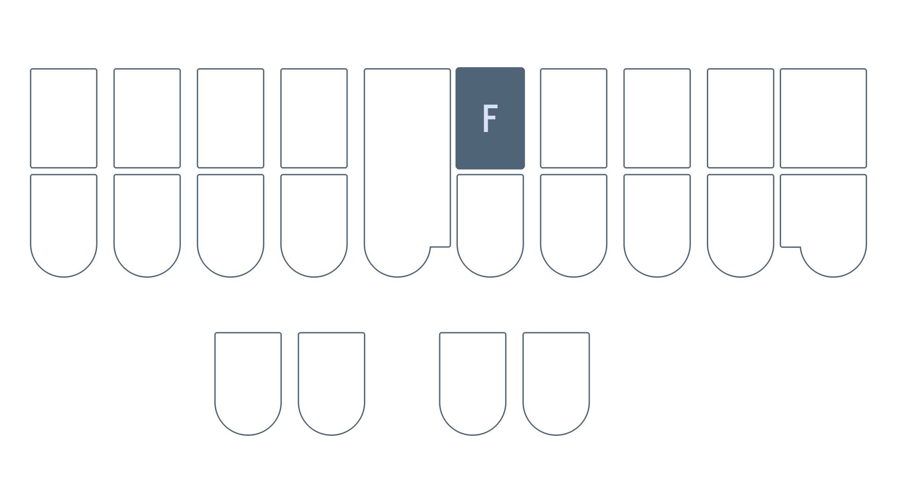
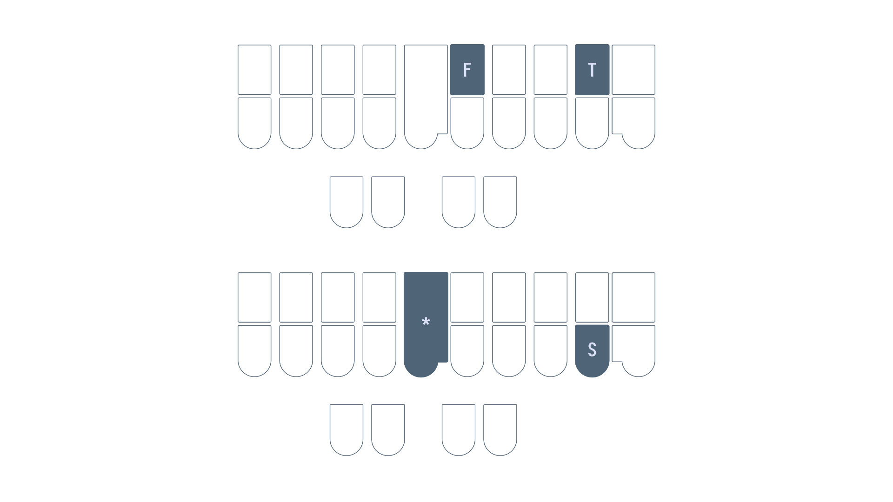
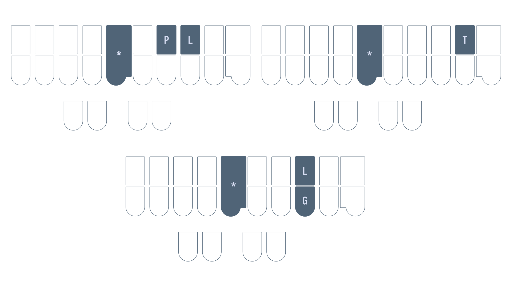

# Chapter 9: Right hand chords

## Recommended pace

**Recommended time to spend on this chapter: 3–6 days.**

1. Read [right hand v](#right-hand-v) and complete the drill (**10 minutes**)
   - Repeat the drill as needed
2. Read [right hand st](#right-hand-st) and complete the drill (**10 minutes**)
   - Repeat the drill as needed
3. Read [right hand m and k](#right-hand-m-and-k) and complete the drill (**20 minutes**)
   - Repeat the drill as needed
4. Read [right hand mp, th, and lk](#right-hand-mp-th-and-lk) and complete the drill (**20 minutes**)
   - Repeat the drill as needed
5. Attempt the [test](#chapter-9-test) (**20 minutes**)
   * Practise as needed

Remember to take breaks!

## Useful links

* [Single syllable right hand v words drill](practice/9-single-syllable-rh-v.txt)
* [Single syllable right hand st words drill](practice/9-single-syllable-rh-st.txt)
* [Single syllable right hand m and k words drill](practice/9-single-syllable-rh-m-and-k.txt)
* [Single syllable right hand mp, th, and lk words drill](practice/9-single-syllable-rh-mp-th-lk.txt)
* [Chapter 9 test](practice/9-test.txt)

## Right hand v

* "v" as in  in "ca<ins>v</ins>e" is `-F`

### Examples
* solve `SOF`
* move `PHAOUF`
* love `HROF`

### Mnemonics:

> Feel free to come up with your own or even suggest some!

1. The "v" sound is quite similar to "f" ("v" is simply voiced "f")

### Conflicts with f

You may run into conflicts where it's ambiguous what the `-F` in a steno outline represents. For example, "safe" and "save" would both be written as `SAEUF`. In these cases, we reserve `-F` for the word spelled with "f" and instead use `*F` for the word spelled with "v":

* safe `SAEUF`
* save `SA*EUF`
* waif `WAEUF`
* waive `WA*EUF`

### Section practice

[Single syllable v words](practice/9-single-syllable-rh-v.txt)

## Right hand st

How would you write the word "fast" with Lapwing theory? We know the left hand initial "f" consonant is `TP` and the vowel is simply just `A`, but what do we do with the ending "-st" consonant? There are, of course, the `-S` and `-T` keys on the right side, but these are out of order. `TPATS` is the word "fats", not "fast".

Handling the ending "-st" consonant is one such situation where different steno theories disagree. In Lapwing theory, we use `-FT` primarily and `*S` when there is a conflict:

* fast `TPAFT`
* haste `HAEUFT`
* cast `KAFT`
* lost `HRO*S` (`HROFT` is already "loft")
* list `HR*EUS` (`HREUFT` is already "lift")
  
#### Section practice

This section's practice material also includes some "-ft" words like "loft" and "lift".

[Single syllable -st words](practice/9-single-syllable-rh-st.txt)

## Right hand m and k

* `-PL` is "-m" as in "cal<ins>m</ins>"
* `-BG` is "k" as in "ba<ins>ck</ins>"

### Examples

* crumb `KRUPL`
* form `TPORPL`
* lark `HRARBG`
* sack `SABG`

### Mnemonics

1. Each of these chords are simply two keys in a row
   * `-PL` is the top row pressed by the middle and ring fingers
   * `-BG` is the bottom row pressed by the middle and ring fingers
2. Think "<ins>pl</ins>u<ins>m</ins>" for `-PL`

### Section practice

[Single syllable m and k words](practice/9-single-syllable-rh-m-and-k.txt)

## Right hand mp, th, and lk

* `*PL` is "-mp" as in "bu<ins>mp</ins>"
* `*T` is "-th" as in "pa<ins>th</ins>"
* `*LG` is "-lk" as in "ca<ins>lc</ins>"

### Examples

* crimp `KR*EUPL`
* shrimp `SHR*EUPL`
* bath `PWA*T`
* moth `PHO*T`
* elk `*ELG`
* talc `TA*LG`

### Mnemonics
> Feel free to come up with your own or even suggest some!

1. `*PL` is the "m" chord with an asterisk
2. `*T` is the `-T` key with an asterisk
3. The "g" and "k" sounds are quite similar and `*LG` is the `-LG` chord with an asterisk

### Section practice:

[Single syllable mp, th, and lk words](practice/9-single-syllable-rh-mp-th-and-lk.txt)

## Chapter 9 test

This chapter's test consists of all the practice drills in this chapter. Make sure your settings are configured as such:

* Limit word count: 45
* Start from word: 1
* Repetitions: 3
* Sort: random
* Show hint for every word: unchecked
* Hide hint on last repetition: unchecked
* Show hint on misstroke: checked

[Click here to access the chapter 9 test](practice/9-test.txt)

### Recommended completion goal

This is only a suggestion; it is not a requirement to move to the next chapter!

**Aim for 10–20 WPM with 90% accuracy.**

**You may use the test material as practice!**
