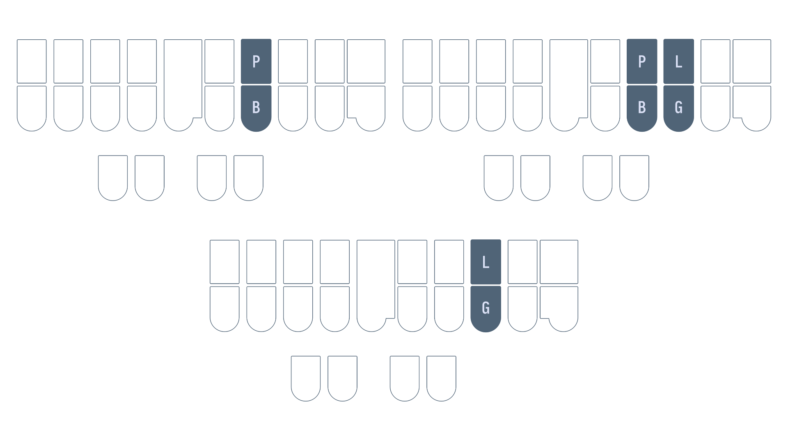
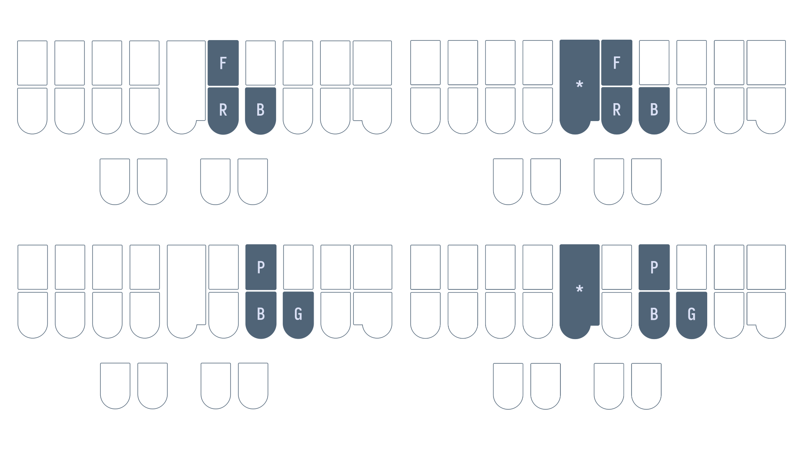
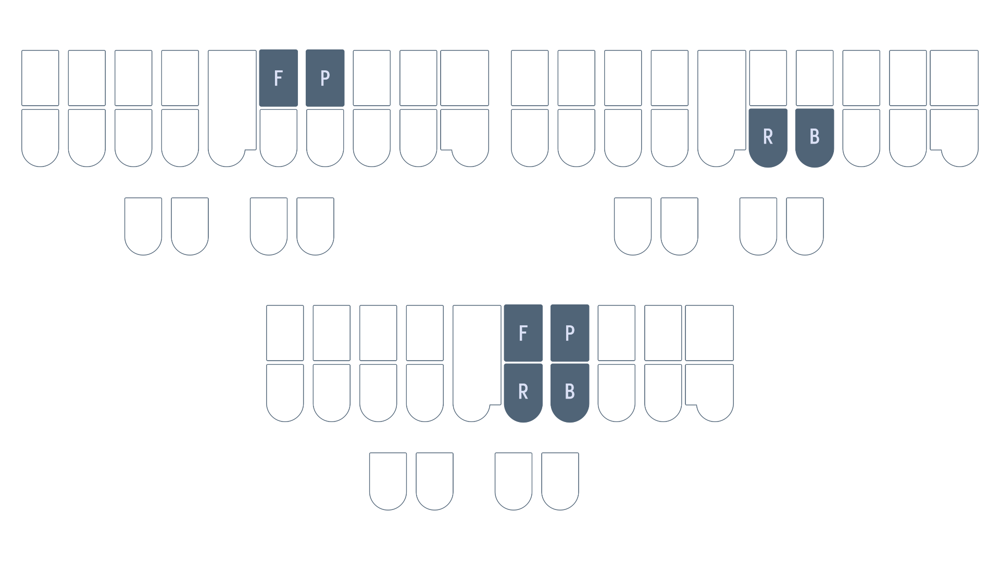

# Chapter 10: Right hand chords continued

## Recommended pace

**Recommended time to spend on this chapter: 2–5 days.**

1. Read [right hand n, j, and lj](#right-hand-n-j-and-lj) and complete the drill (**20 minutes**)
   - Repeat the drill as needed
2. Read [right hand rv, rf, ng, and nk](#right-hand-rv-rf-ng-and-nk) and complete the drill (**20 minutes**)
   - Repeat the drill as needed
3. Read [right hand ch, sh and rch](#right-hand-ch-sh-and-rch) and complete the drill (**20 minutes**)
   - Repeat the drill as needed
4. Attempt the [test](#chapter-10-test) (**20 minutes**)
   * Practise as needed

Remember to take breaks!

## Useful links

* [Single syllable right hand n, j, and lj words drill](practice/10-right-n-j-lj.txt)
* [Single syllable right hand rv, rf, ng, and nk words](practice/10-right-rv-rf-ng-nk.txt)
* [Single syllable right hand ch, sh, and rch/nch words](practice/10-right-ch-sh-rch.txt)
* [Chapter 10 test](practice/10-test.txt)

## Right hand n, j, and lj

* `-PB` is "-n" as in "law<ins>n</ins>"
* `-PBLG` is "-j" as in "gru<ins>dg</ins>e"
* `-LG` represents two two sounds:
  * "-lj" as in "bu<ins>lg</ins>e"
  * "-lch" as in "mu<ins>lch</ins>"

### Examples
* fin `TPEUPB`
* sign `SAOEUPB`
* lodge `HROPBLG`
* nudge `TPHUPBLG`
* bilge `PWEULG`
* belch `PWELG`
* squelch `SKWELG`

### Mnemonics:

> Feel free to come up with your own or even suggest some!

1. Think "<ins>p</ins>ea<ins>n</ins>ut <ins>b</ins>utter" for `-PB`
2. `-PBLG` is a cluster of 4 keys pressed with the right hand middle and ring fingers
3. `-LG` resembles the "-lg" sound in spelling and is somewhat close to the "-lch" sound

### Section practice

[Single syllable right hand n, j, and lj/lch words](practice/10-right-n-j-lj.txt)

## Right hand rv, rf, ng, and nk

* `-FRB` is "-rv" as in "swe<ins>rv</ins>e"
* `*FRB` is "-rf" as in "tu<ins>rf</ins>"

> The reason `-FRB` is "-rv" and not "-rf" is that the former is a bit more common.

* `-PBG` represents two sounds:
  * "-ng" as in "ta<ins>ng</ins>"
  * "-nj" as in "stra<ins>ng</ins>e"
* `*PBG` is "-nk" as in "pla<ins>nk</ins>"

### Examples
* curve `KUFRB`
* carve `KAFRB`
* turf `T*UFRB`
* serf `S*EFRB`
* ling `HREUPBG`
* sing `SEUPBG`
* tank `TA*PBG`
* sink `S*EUPBG`

### Mnemonics:

> Feel free to come up with your own or even suggest some!

1. `-FRB` contains the `-R` key and also looks like the letter "v" on its side
2. The "v" and "f" sounds are quite similar; the "-rf" chord is almost the same as the "-rv"  but with the asterisk
3. `-PBG` is simply just the "n" chord and the `-G` key combined
4. `*PBG` is just the "-ng" chord with the asterisk (the "-ng" and "-nk" sounds are quite similar)

### Section practice

[Single syllable right hand rv, rf, ng, and nk words](practice/10-right-rv-rf-ng-nk.txt)

## Right hand ch, sh, and rch

* `-FP` is "-ch" as in "cou<ins>ch</ins>"
* `-RB` is "-sh" as in "tra<ins>sh</ins>"
  - `-RBS` is the "shus" sound as in "cau<ins>tious</ins>"
* `-FRPB` represents two sounds:
  - "-rch" as in "a<ins>rch</ins>"
  - "-nch" as in "hu<ins>nch</ins>"

### Examples
* hitch `HEUFP`
* patch `PAFP`
* mash `PHARB`
* sash `SARB`
* luscious `HRAOURBS`
* spacious `SPAEURBS`
* larch `HRAFRPB`
* parch `PAFRPB`
* crunch `KRUFRPB`
* punch `PUFRPB`

### Mnemonics:

> Feel free to come up with your own or even suggest some!

1. `-FP` and `-RB` are rows of horizontal keys pressed by the right hand index and middle fingers
   - These are both *h chords, remember that `-FP` comes before `-RB` in steno order which matches up with the letter "c" coming before "s" in the alphabet
2. The "-rch"/"-nch" chord `-FRPB` is the combination of the previous two

### Section practice

[Single syllable right hand ch, sh, and rch/nch words](practice/10-right-ch-sh-rch.txt)

## Chapter 10 test

This chapter's test consists of all the practice drills in this chapter. Make sure your settings are configured as such:

* Limit word count: 45
* Start from word: 1
* Repetitions: 3
* Sort: random
* Show hint for every word: unchecked
* Hide hint on last repetition: unchecked
* Show hint on misstroke: checked

[Click here to access the chapter 10 test](practice/10-test.txt)

### Recommended completion goal

This is only a suggestion; it is not a requirement to move to the next chapter!

**Aim for 10–20 WPM with 90% accuracy.**

**You may use the test material as practice!**

## Chapter briefs

> This section is completely optional, but recommended. If you prefer to learn these all at once, they will be covered in chapter 16.

| Translation | Brief | Explanation |
| ---- | ---- | ---- |
| be | `-B` | Single key brief for a common word |
| been | `PW-PB` | Drops the vowel |
| differ | `TKEUFR` | Drops the second vowel (*using `-FR` for the "f_r" sound is a common briefing technique*) |
| even | `AOEFPB` | Drops the second vowel |
| of | `-F` | Single key brief for a common word |
| one | `WUPB` | Not so much a brief as just an odd word |
| only | `OEPBL` | <ins>onl</ins>y |
| self | `SEFL` | Uses an inversion of steno order |
| they | `THE` | <ins>the</ins>y |
| think | `THEU` | <ins>thi</ins>nk (easier to write than `TH*EUPBG`) |

> **NOTE:** remember that these are briefs; the explanations are not applicable to any arbitrary word.

### Practice sentences
1. they even think of mulch.
1. hat and cat differ only in one thing.
1. I have been very well.
1. self love is a must.

#### Answers
1. `THE/AOEFPB/THEU/-F/PHULG/TP-PL`
1. `HAT/SKP/KAT/TKEUFR/OEPBL/TPH/WUPB/THEUPBG/TP-PL`
1. `EU/SR/PW-PB/SRE/WEL/TP-PL`
1. `SEFL/HROF/S/AEU/PHUFT/TP-PL`

### Extra briefs

| Brief | Outline | Explanation |
| ---- | ---- | ---- |
| they are | `THER` | `THE` + `-R` |
| they're | `TH*ER` | `THE` + `-R` + `*` |
| one of | `WUFPB` | `WUPB` + `-F` |
