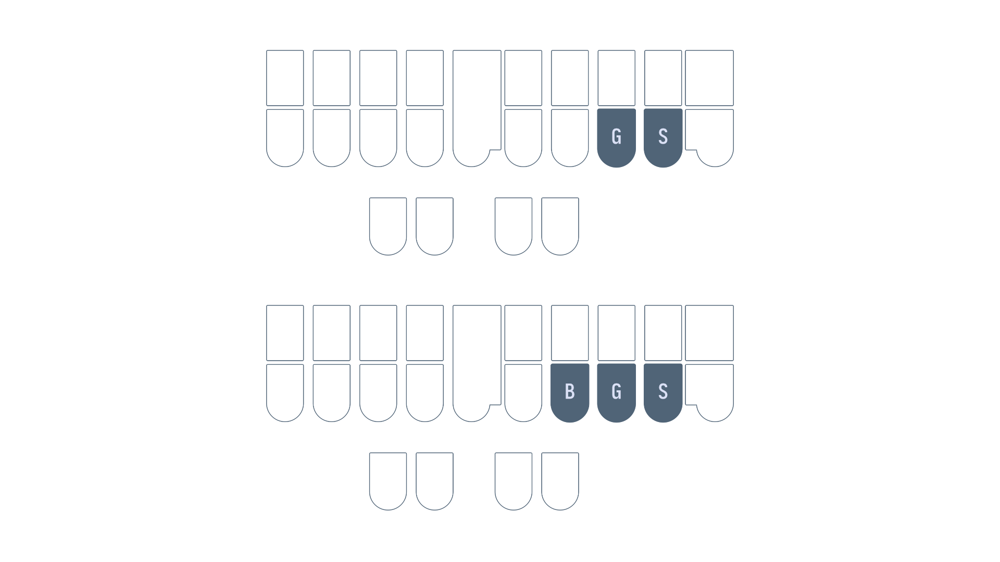
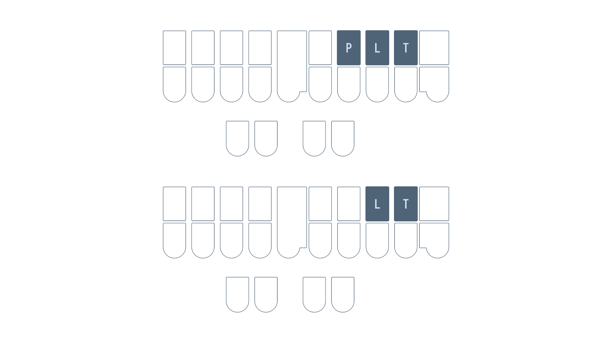

# Chapter 11: Right hand compound clusters

## Recommended pace

**Recommended time to spend on this chapter: 1–3 days.**

1. Read [right hand shun and kshun](#right-hand-shun-kshun) and complete the drill (**20 minutes**)
   - Repeat the drill as needed
2. Read [right hand ment and let](#right-hand-ment-and-let) and complete the drill (**20 minutes**)
   - Repeat the drill as needed
3. Read [right hand bl](#right-hand-bl) and complete the drill (**20 minutes**)
   - Repeat the drill as needed
6. Attempt the [test](#chapter-10-test) (**20 minutes**)
   * Practise as needed

Remember to take breaks!

## Useful links

* [Right hand shun, kshun, and x words](practice/11-right-shun-kshun-and-x.txt)
* [Right hand ment and let words drill](practice/11-right-ment-and-let.txt)
* [Right hand `-BL` words drill](practice/11-right-BL.txt)
* [Chapter 11 test](practice/11-test.txt)

## Intro

All the chords covered so far represent single sounds. However, there are some chords (particularly on the right hand) that can represent multiple syllables. These are referred to as compound clusters.

## Right hand shun, kshun, and x

* `-GS` is "-shun" as in "o<ins>cean</ins>"
* `-BGS` represents two sounds:
  - "-x" as in "ta<ins>x</ins>"
  - "-kshun" as in in "fri<ins>ction</ins>"

### Examples
* motion `PHOEGS`
* caution `KAUGS`
* fax `TPABGS`
* tex `TEBGS`

### "-kshun" and "-x" conflicts
Some words like "a<ins>x</ins>e" and "a<ins>ction</ins>" conflict with the same outline: `ABGS`. In these cases, the "-x" sound is given higher priority and "-kshun" sound is relegated to `*BGS` (same chord, but with the asterisk key).

#### Examples

* faction `TPA*BGS` (since `TPABGS` is already "fax")
* section `S*EBGS` (since `SEBGS` is already "sex")

### Mnemonics:

> Feel free to come up with your own or even suggest some!

1. "mu<ins>gs</ins> in the o<ins>cean</ins>"
2. `-BGS` as the "-x" chord is simply just the combination of the "-k" chord `-BG` and the `-S` key
3. `-BGS` as the "-kshun" chord overlaps with the "-k" chord `-BG` and the "-shun" chord `-GS`

### Section practice

[Right hand shun, kshun, and x words](practice/11-right-shun-kshun-and-x.txt)

## Right hand ment and let

* `-PLT` is "-ment" as in "mo<ins>ment</ins>"
* `-LT` is "-let" as in "scar<ins>let</ins>"

### Examples
* garment `TKPWARPLT`
* torment `TORPLT`
* roulette `RAOULT`
* wallet `WAULT`

### Mnemonics:

> Feel free to come up with your own or even suggest some!

1. Taking the middle out of "ment" gives "mt" which is what `-PLT` represents
2. Taking the middle out of "let" gives "lt" which is what `-LT` represents

### Section practice

[Right hand ment and let words](practice/11-right-ment-and-let.txt)

Unfortunately, there is not a lot of practice material for single stroke words containing these chords.

## Right hand `-BL`

* `-BL` represents several different sounds:
   - "-bl" as in "dou<ins>bl</ins>e"
   - "-abl" as in "pli<ins>abl</ins>e"
   - "-ibl" as in "poss<ins>ibl</ins>e"
   - "-b_l" as in "glo<ins>bal</ins>", "mo<ins>bil</ins>e", "la<ins>bel</ins>"

All these sounds are similar to one another in that they all contain "bl" and optionally an **unstressed vowel**. This refers to a vowel that isn't emphasized. Think about how the phrase "lay bell" differs in sound to the word "label". In the first case, the "e" is stressed while in the second case, it is not.

### Examples

* pebble `PEBL`
* wobble `WOBL`
* playable `PHRAEUBL`
* chewable `KHAOUBL`
* tribal `TRAOEUBL`
* rebel `REBL`

> **NOTE:** the word "rebel" can be pronounced as `RAOE/PWEL` or `REBL` depending on if it is a verb or a noun. While the dictionary contains both, the single stroke variant is recommended as it is faster.

### Mnemonics:

> Feel free to come up with your own or even suggest some!

1. `-BL` already looks a lot like the sounds it represents; remember to skip over any unstressed vowels as well.

### Section practice

[Right hand `-BL` words drill](practice/11-right-BL.txt)

Unfortunately, there is not a lot of practice material for single stroke words containing these chords.

## Chapter 11 test

This chapter's test consists of all the practice drills in this chapter. Make sure your settings are configured as such:

* Limit word count: 45
* Start from word: 1
* Repetitions: 3
* Sort: random
* Show hint for every word: unchecked
* Hide hint on last repetition: unchecked
* Show hint on misstroke: checked

[Click here to access the chapter 11 test](practice/11-test.txt)

### Recommended completion goal

This is only a suggestion; it is not a requirement to move to the next chapter!

**Aim for 10–20 WPM with 90% accuracy.**

**You may use the test material as practice!**

## Chapter briefs

> This section is completely optional, but recommended. If you prefer to learn these all at once, they will be covered in chapter 16.

| Translation | Brief | Explanation |
| ---- | ---- | ---- |
| every | `EFR` | <ins>ev</ins>e<ins>r</ins>y |
| first | `TPEUFRT` | Uses an inversion of steno order (`-R` and `-F` are swapped) with the `-F` representing "s" |
| follow | `TPOL` | <ins>fol</ins>low |
| where | `W-R` | <ins>w</ins>he<ins>r</ins>e |
| could | `KUD` | |
| would | `WUD` | |
| should | `SHUD` | |
| through | `THRU` | `THRAOU` is the word "threw" |

> **NOTE:** remember that these are briefs; the explanations are not applicable to any arbitrary word.

### Practice sentences
1. should you follow them?
1. could we first pass through?
1. would you know every place?
1. where are they?

#### Answers
1. `SHUD/U/TPOL/THEPL/KW-PL`
1. `KUD/WAOE/TPEUFRT/PAS/THRU/KW-PL`
1. `WUD/U/TPHOE/EFR/PHRAEUS/KW-PL`
1. `W-R/-R/THE/KW-PL`

### Extra briefs

| Brief | Outline | Explanation |
| ---- | ---- | ---- |
| everyone | `EFRPB` | `EFR` + `-PB` |
| everywhere | `WEFRB` | `EFR` + `W-R` |
| where the | `W-RT` | `W-R` + `-T` |
| through the | `THRUT` | `THRU` + `-T` |
