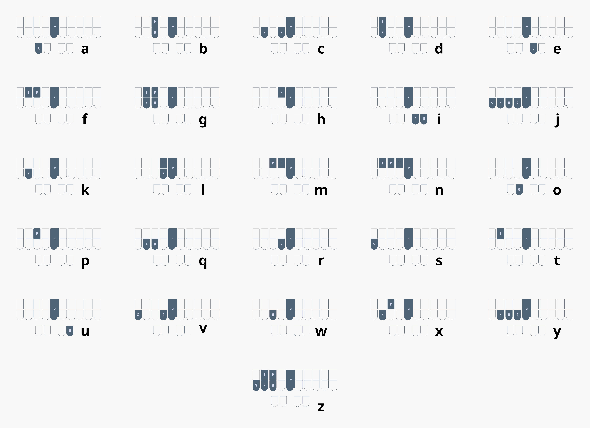
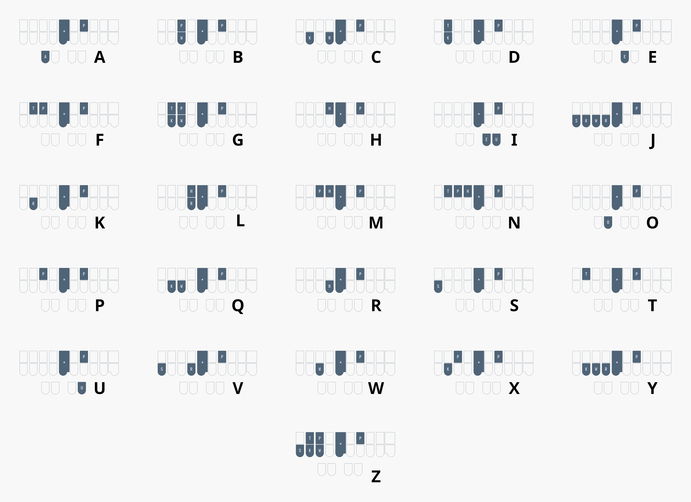
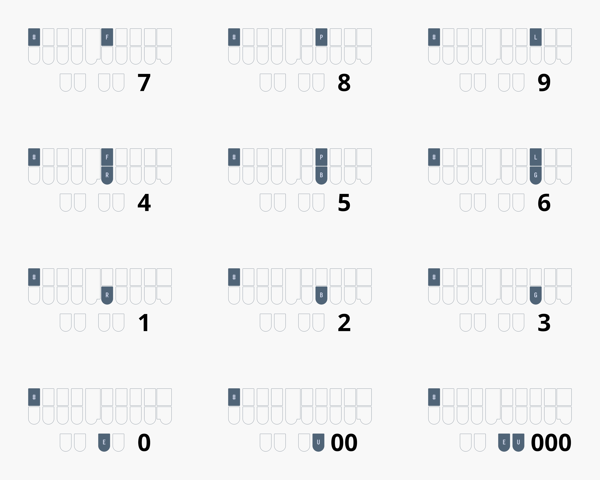

# Chapter 17: Fingerspelling and numbers

## Recommended pace

**Recommended time to spend on this chapter: 1 day.**

1. Read [fingerspelling](#fingerspelling) (**10 minutes**)
2. Read [numbers](#numbers) (**10 minutes**)

Remember to take breaks!

## Useful links

* [Fingerspelling graphic (lowercase)](img/17-fingerspelling-lower.png)
* [Fingerspelling graphic (uppercase)](img/17-fingerspelling-upper.png)
* [Numbers graphic](img/17-numbers.png)

## Intro

There won't be any practice material for this chapter as these topics are easy to practise just by using steno in everyday writing. I would, however, recommend printing out these graphics and keeping them somewhere easily read.

## Fingerspelling
If you need to write a short acronym or a word that is not in your dictionary, you need to fallback onto letter-by-letter spelling—a technique called fingerspelling. This is done by pressing letter chord plus the asterisk key with the right hand.

### Lowercase

### Uppercase
To write uppercase letters, use `-P` on the right hand.

### Attachment behaviour
Fingerspelling uses "glue" formatting. These translations stick to other translations which use the "glue formatting". If you last wrote a word without the "glue" formatting, pressing a fingerspelling chord would create a new word. However, any subsequent fingerspelling chords would stick to the last fingerspelled translation.

#### Examples
* `A*/PW*/KR*` abc
* `HE/HROE/A*/PW*/KR*/HE/HROE` hello abc hello

## Numbers

Up until now, we have never used the number key above the left hand `S` key. This key is (shockingly) used for writing numbers (among other things). On the right hand, we use a numberpad much like traditional computer numberpads or the ones you find on calculators.

There are, of course, only two rows on the steno layout, so we use vertical chords to represent the middle row.

The right hand vowel keys are special in that they can be combined with a number chord to add some trailing zeros:

* `#ER` 10
* `#EUPB` 5000
* `#UP` 800
* `#EB` 20

### Attachment behaviour
Numbers use the same "glue" formatting that stick to other translations which are formatted similarly. This means that numbers will stick to fingerspelled translations and other numbers. If you don't want this "glue" behaviour, you can use `#T` in the chord.

#### Examples
* `A*/PW*/KR*/#-R/#-B/#-G` abc123
* `A*/PW*/KR*/#T-R/#T-B/#T-G` abc 1 2 3

## No test this chapter!