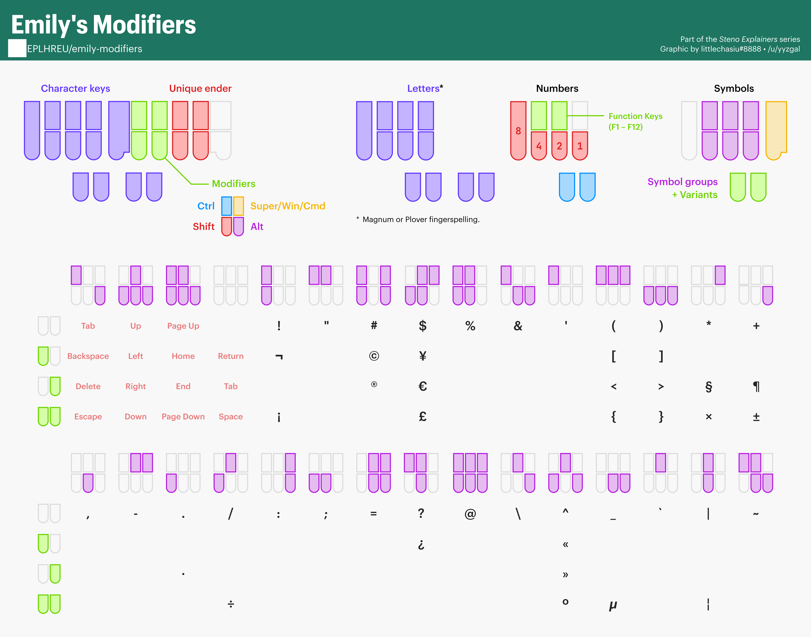

# Chapter 25: Symbols and modifiers

Basic punctuation and Plover commands were covered in [chapter 19](Chapter-19.md) but writing other symbols was not. Lapwing theory really only covers writing English prose, and so symbols is beyond its scope. However, instead of adding every symbol to your dictionary, there are preexisting ones that you can download and use. The same goes for writing keyboard shortcuts, also called "modifiers".

On this page, I've listed other dictionaries that I use for symbols and shortcuts. It's difficult to learn these by drilling them, so instead I recommend referring back to the documentation pages or the graphics made by @sammdot whenever you need to. Printing the graphics out and attaching them to your wall is also very handy.

## Python dictionaries

Most dictionaries for writing symbols and modifiers use python dictionaries. In contrast to JSON or RTF dictionaries (which are essentially just lists of outlines and their translations), Python dictionaries generate their translations "on the fly". When an outline is received, the python dictionary parses each part of the outline and determines how to combine them all in one translation. This is useful for systematic dictionaries such as those for writing keyboard shortcuts and symbols.

### Setup

Make sure you are using the <code>plover-lapwing-aio</code> plugin, or you have manually configured your dictionary stack by following [these instructions](Appendix-B.md).

## Emily's symbols dictionary

This dictionary allows you to write any symbol available on a regular keyboard. In one stroke, you can control the spacing, repetition, and capitalization of the next word.

### Usage

Emily's symbol dictionary uses a unique starting chord on the left `SKWH`. This chord does not represent a useful sound in English, so we can be sure any outline with this chord on the left hand side will not conflict with any preexisting words.

The right hand determines which symbol to write as well as the repetition. The left hand vowels control the spacing.

For example, to write `!!!! ` (space on the right side and next word capitalized) you would use `SKWHO*FRTS`.

Breaking down this stroke looks like this:

1. `SKWH` left hand starting chord
2. `O` insert space on the right
3. `*` capitalize the next word
4. `-FR` chord for the exclamation mark
4. `-TS` repeat 4 times

## Emily's modifiers dictionary

This dictionary allows you to write any shortcut possible on a regular keyboard in one stroke.

### Usage

Similar to her symbols dictionary, Emily's modifier dictionary uses a unique right hand ender chord: `-LGTS`. As this is a very rare chord, we can be sure that any outline including this chord does not conflict with any other words. The Ctrl, Shift, Alt, and Super (Windows) keys are pressed with the right index and middle finger and the letter or symbol is pressed with the left hand.

To write <code>Ctrl+Shift+C</code> you would write `KR-FRLGTS`.

Breaking down this stroke looks like this:

1. `-LGTS` right hand ending chord
2. `-FR` chord for Ctrl and Shift
3. `KR` chord for C

> **NOTE:** if you downloaded Emily's modifiers dictionary, you will find that the unique ending chord is actually `-LTZ` by default. It was changed to `-LGTS` in Lapwing. Keep this in mind if you seek out official documentation on the system.

## Abby's left hand modifiers dictionary

This dictionary enables writing shortcuts with only one hand. Each shortcut is written using two strokes on the left.

### Usage

To write <code>Ctrl+V</code> you would write `KHR/SR`.

Breaking down this outline looks like:

1. `KHR` chord for Ctrl
2. `SR` chord for V

See the [readme](https://github.com/Abkwreu/plover-left-hand-modifiers/#abbys-left-hand-modifiers-dictionary) for more details.

## Learning these systems

I recommend keeping these graphics somewhere easily visible (such as on your wall or on your desktop wallpaper). Instead of drilling random strokes, I suggest just incorporating these systems into your steno computer usage and slowly learning them gradually. Abby's left hand modifiers dictionary is quite intuitive, and I would start there with simple shortcuts such as copying and pasting.
