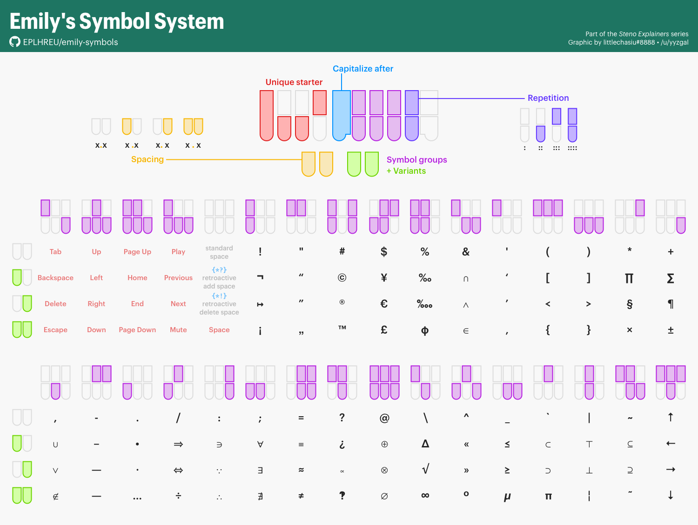

# Chapter 25: Symbols and modifiers

Basic punctuation and Plover commands were covered in [chapter 19](Chapter-19.md) but writing other symbols was not. Lapwing theory really only covers writing English prose, and so symbols is beyond its scope. However, instead of adding every symbol to your dictionary, there are preexisting ones that you can download and use. The same goes for writing keyboard shortcuts, also called "modifiers".

On this page, I've listed other dictionaries that I use for symbols and shortcuts. It's difficult to learn these by drilling them, so instead I recommend referring back to this page you need to. Printing out the graphics on this page and pinning them to your wall can also come in handy.

> **NOTE:** the original dictionaries listed on this page have been altered slightly in the Lapwing plugin. Please keep this in mind if you seek official documentation on any of these dictionaries on their source pages.

> I would like to expanding this page and make it the only necessary documentation to learn these dictionaries. If you would like to see this happen sooner, [consider contributing](https://www.paypal.com/donate/?hosted_button_id=VNMUULBPTQGMC) :)

## Python dictionaries

Most dictionaries for writing symbols and modifiers use python dictionaries. In contrast to JSON or RTF dictionaries (which are essentially just lists of outlines and their translations), Python dictionaries generate their translations "on the fly". When an outline is received, the python dictionary parses each part of the outline and determines how to combine them all in one translation. This is useful for systematic dictionaries such as those for writing keyboard shortcuts and symbols.

### Setup

Ensure that <code class="code-mono">plover-lapwing-aio</code> is installed and <code class="code-mono">Lapwing</code> is selected as the system. Alternatively, if you are setting up [Lapwing manually](Appendix-B.md) (not recommended), ensure that <code class="code-mono">lapwing-uk-additions.json</code> is in your dictionary stack.

## Emily's symbols dictionary

This dictionary allows writing any symbol that is available on a regular keyboard. In one stroke, spacing, repetition, and capitalization of the next word can be controlled.

### Usage

Emily's symbol dictionary uses a unique starting chord on the left `SKWH`. This chord does not represent a useful sound in English, so we can be sure any outline with this chord on the left hand side will not conflict with any preexisting words.

The right hand determines which symbol to write as well as the repetition. The left hand vowels control the spacing.

For example, to write <code class="code-mono">!!!! </code> (space on the right side and next word capitalized) use `SKWHO*FRTS`.

Breaking down this stroke looks like this:

1. `SKWH` left hand starting chord
2. `O` insert space on the right
3. `*` capitalize the next word
4. `-FR` chord for the exclamation mark
4. `-TS` repeat 4 times

## Emily's modifiers dictionary

This dictionary allows writing any keyboard shortcut that can be pressed on a regular keyboard.

### Usage

Similar to her symbols dictionary, Emily's modifier dictionary uses a unique right hand ender chord: `-LGTS`. As this is a very rare chord, any modifier outline will likely not conflict with any pre-existing outlines. The Ctrl, Shift, Alt, and Super (Windows) keys are pressed with the right index and middle finger and the letter or symbol is pressed with the left hand.

To write <code class="code-mono">Ctrl+Shift+C</code> you would write `KR-FRLGTS`.

Breaking down this stroke looks like this:

1. `-LGTS` right hand ending chord
2. `-FR` chord for Ctrl and Shift
3. `KR` chord for C

> **NOTE:** Emily's modifiers in the Lapwing plugin was changed recently. The above graphic is consistent with the latest dictionary. If you are encountering issues with the graphic not being accurate, see chapter 5 on [updating your dictionary](Chapter-05.md#dictionary-updates).

## Abby's left hand modifiers dictionary

This dictionary enables writing shortcuts with only one hand. Each shortcut is written using two strokes on the left.

### Usage

To write <code class="code-mono">Ctrl+V</code> you would write `KHR/SR`.

Breaking down this outline looks like:

1. `KHR` chord for Ctrl
2. `SR` chord for V

See the [readme](https://github.com/Abkwreu/plover-left-hand-modifiers/#abbys-left-hand-modifiers-dictionary) for more details.

> **NOTE:** numbers and function keys have been altered in the Lapwing version of Abby's left hand modifiers to match Emily's modifiers. Better standalone documentation on this site for Abby's left hand modifiers is work-in-progress.

## Learning these systems

I recommend keeping these graphics somewhere easily visible (such as on your wall or on your desktop wallpaper). Instead of drilling random strokes, I suggest just incorporating these systems into your steno computer usage and slowly learning them gradually. Abby's left hand modifiers dictionary is quite intuitive, and I would start there with simple shortcuts such as copying and pasting.